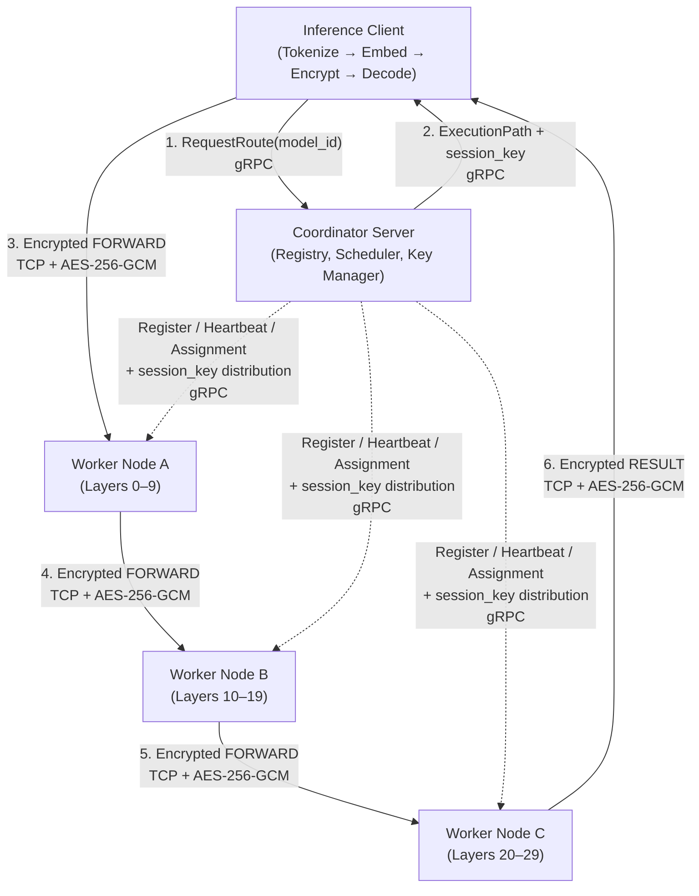
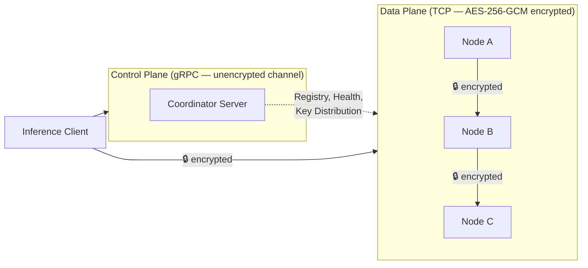
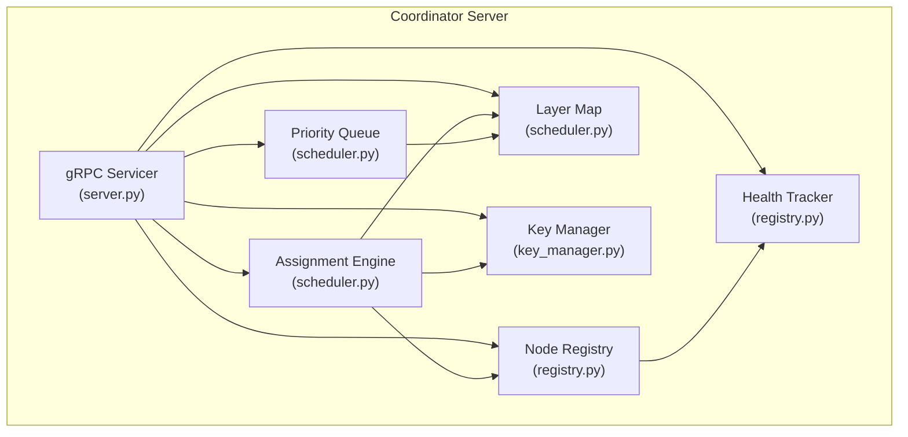
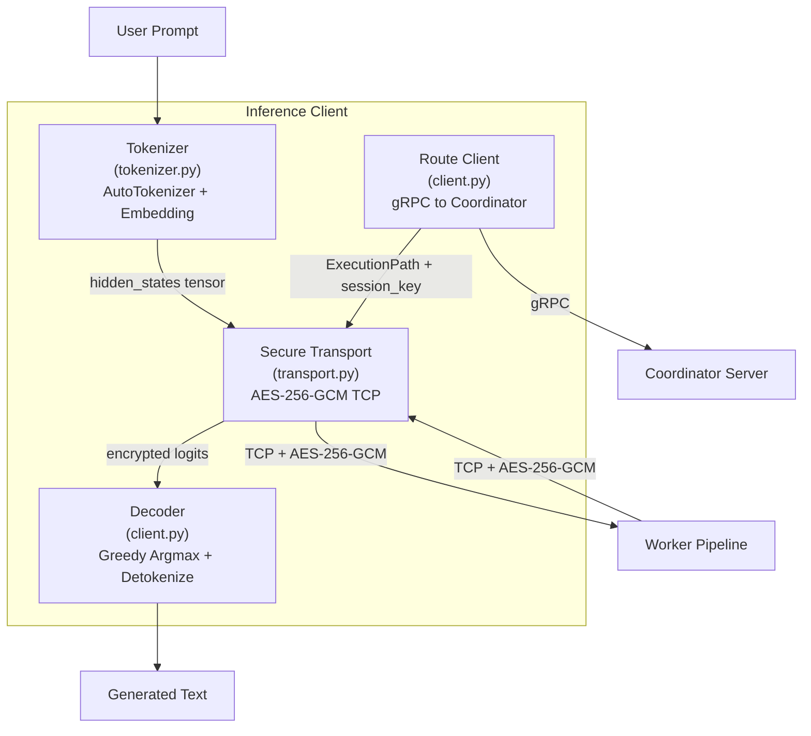
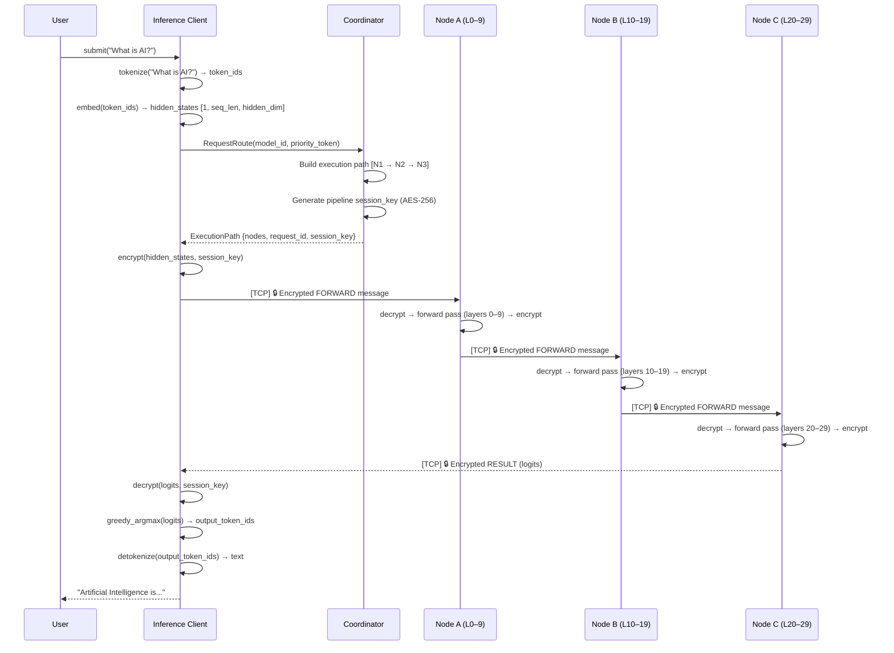
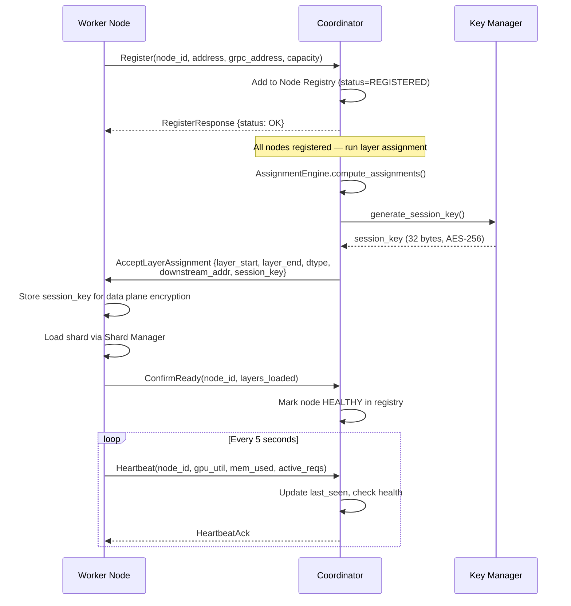
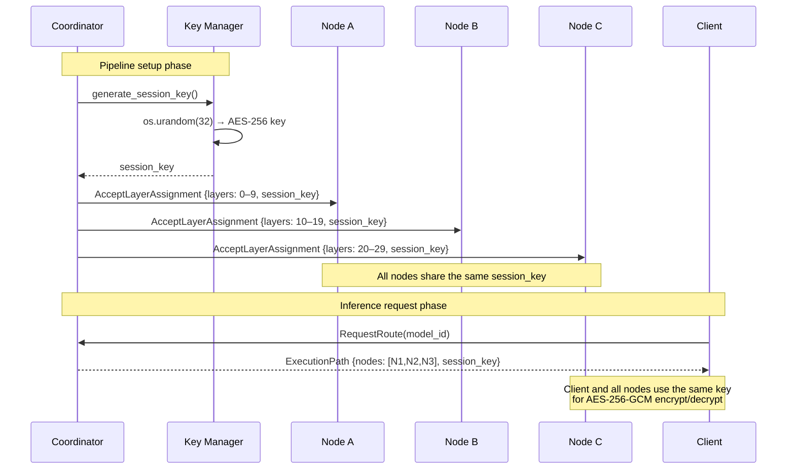
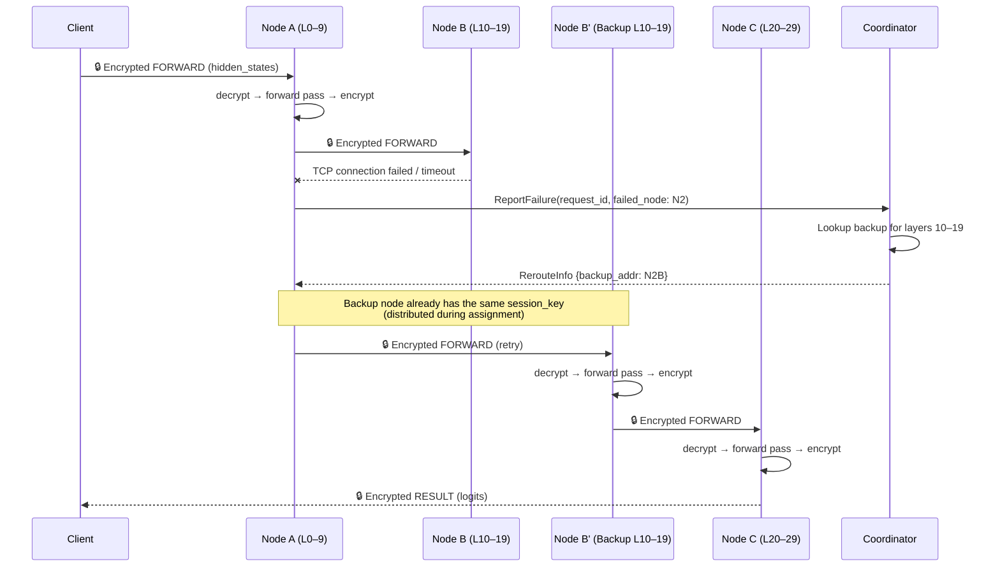
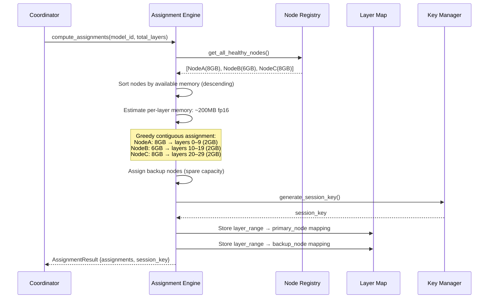
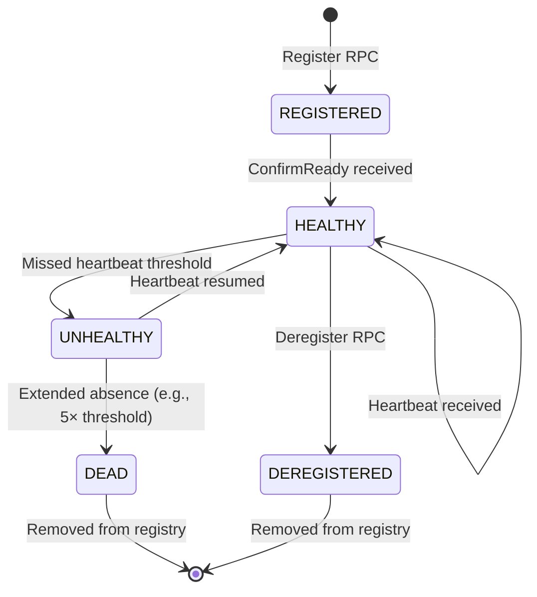

# Design Document: Coordinator Server & Inference Client

## Overview

This design covers the two remaining control-plane components of the MeshRun distributed AI inference pipeline: the Coordinator Server and the Inference Client. Together with the already-implemented Worker Node data plane, these components complete the end-to-end system.

The Coordinator Server is the central control plane. It manages the lifecycle of all worker nodes in the cluster — accepting registrations, tracking health via heartbeats, computing static layer assignments based on GPU capacity, building execution routes for inference requests, distributing AES-256-GCM session keys for encrypted data-plane traffic, and orchestrating fault tolerance through backup node assignment. The Coordinator exposes a gRPC service and never touches inference data directly.

The Inference Client is the user-facing entry point. It tokenizes raw text input using a HuggingFace AutoTokenizer matched to the served model, runs the embedding layer locally (selectively downloaded from the same safetensors model file using the existing Shard Manager's HTTP Range request infrastructure), acquires an execution route and session key from the Coordinator via gRPC, encrypts the initial hidden states using AES-256-GCM (reusing `protocol.py`'s `write_message_secure`), sends them to the first pipeline node over TCP, receives encrypted logits from the final node, decrypts, decodes via greedy argmax, and detokenizes back to text.

A critical cross-cutting concern is encryption in transit. The existing `protocol.py` already implements AES-256-GCM authenticated encryption (`write_message_secure`, `read_message_secure`, `generate_session_key`). This design introduces a Key Manager in the Coordinator that generates per-pipeline session keys and distributes them to all participants (worker nodes and client) so the entire data plane is encrypted end-to-end. The worker node's serving loop and connection handling must be updated to use the secure read/write variants.

## Architecture

### System Overview (with Encryption)



### Control Plane vs Data Plane with Encryption Boundary



### Coordinator Server Internal Architecture



### Inference Client Internal Architecture



## Sequence Diagrams

### End-to-End Encrypted Inference Flow



### Node Registration with Session Key Distribution



### Session Key Distribution Flow



### Fault Tolerance with Encrypted Reroute



### Layer Assignment Algorithm Flow



## Components and Interfaces

### Component 1: Coordinator Server (`meshrun/coordinator/`)

The Coordinator is the central control plane. It manages node lifecycle, computes layer assignments, builds execution routes, distributes encryption keys, and handles fault tolerance. It never touches inference tensor data.

#### 1a. gRPC Service (`server.py`)

**Purpose**: Exposes the Coordinator's functionality as a gRPC service. Implements the servicer class generated from the `.proto` definition. Wires incoming RPCs to the internal components (registry, scheduler, key manager).

**gRPC Service Definition** (`meshrun/coordinator/proto/coordinator.proto`):

| RPC Method              | Request                        | Response                        | Description                                                                          |
| ----------------------- | ------------------------------ | ------------------------------- | ------------------------------------------------------------------------------------ |
| `Register`              | `RegisterRequest`              | `RegisterResponse`              | Worker node self-registers with capacity info                                        |
| `Heartbeat`             | `HeartbeatRequest`             | `HeartbeatResponse`             | Periodic health signal from worker node                                              |
| `ConfirmReady`          | `ConfirmReadyRequest`          | `ConfirmReadyResponse`          | Worker signals shard loaded and ready                                                |
| `Deregister`            | `DeregisterRequest`            | `DeregisterResponse`            | Worker node graceful removal                                                         |
| `RequestRoute`          | `RequestRouteRequest`          | `RequestRouteResponse`          | Client requests execution path + session key                                         |
| `ReportFailure`         | `ReportFailureRequest`         | `ReportFailureResponse`         | Worker reports downstream node failure                                               |
| `TriggerAssignment`     | `TriggerAssignmentRequest`     | `TriggerAssignmentResponse`     | Admin triggers layer assignment computation                                          |
| `AcceptLayerAssignment` | `AcceptLayerAssignmentRequest` | `AcceptLayerAssignmentResponse` | Coordinator pushes assignment to worker (server-initiated via worker's gRPC address) |

**Responsibilities**:
- Start and stop the gRPC server on a configurable port
- Translate protobuf messages to/from internal Python dataclasses
- Delegate all business logic to registry, scheduler, and key manager
- Handle concurrent RPCs safely (gRPC server is inherently multi-threaded)

**Proto Stub Generation**: The `.proto` file is compiled using `grpcio-tools` (`python -m grpc_tools.protoc`) to generate `coordinator_pb2.py` and `coordinator_pb2_grpc.py` stubs. These stubs are used by both the server (servicer) and the worker's `GrpcCoordinatorClient`.

---

#### 1b. Node Registry & Health Tracker (`registry.py`)

**Purpose**: Maintains the live registry of all worker nodes and tracks their health status via heartbeat monitoring. This is the single source of truth for which nodes are available and healthy.

**Interface**:

| Method                  | Input                    | Output                | Description                                       |
| ----------------------- | ------------------------ | --------------------- | ------------------------------------------------- |
| `register_node`         | `NodeRegistration`       | `RegistrationResult`  | Add node to registry, set status REGISTERED       |
| `deregister_node`       | `node_id`                | `bool`                | Remove node, return success                       |
| `update_heartbeat`      | `node_id, metrics`       | `HeartbeatResult`     | Update last_seen + metrics, return health status  |
| `mark_node_healthy`     | `node_id`                | `None`                | Transition node to HEALTHY (after ConfirmReady)   |
| `get_node`              | `node_id`                | `NodeEntry` or `None` | Lookup single node                                |
| `get_all_healthy_nodes` | —                        | `list[NodeEntry]`     | All nodes with status HEALTHY                     |
| `get_nodes_for_layers`  | `layer_start, layer_end` | `list[NodeEntry]`     | Nodes hosting the given layer range               |
| `check_health`          | —                        | `list[node_id]`       | Run health check, return newly-unhealthy node IDs |

**Node Status Lifecycle**:



**Health Check Logic**:
- A background thread runs every `heartbeat_interval_s` (default 5s)
- For each node: if `now - last_seen > missed_threshold * heartbeat_interval_s`, mark UNHEALTHY
- Default missed threshold: 3 consecutive misses (15 seconds)
- UNHEALTHY nodes are excluded from route building but remain in registry for potential recovery
- DEAD nodes (5× threshold = 25 seconds) are candidates for removal

**Thread Safety**: All registry mutations are protected by a `threading.Lock`. The health check thread acquires the lock for the duration of its scan.

---

#### 1c. Scheduler: Layer Assignment + Route Building + Priority Queue (`scheduler.py`)

**Purpose**: Computes static layer assignments at cluster startup, builds execution routes for inference requests, and manages the priority queue for request scheduling.

**Layer Assignment Interface**:

| Method                       | Input                           | Output                     | Description                        |
| ---------------------------- | ------------------------------- | -------------------------- | ---------------------------------- |
| `compute_assignments`        | `model_id, total_layers, dtype` | `AssignmentPlan`           | Greedy contiguous layer assignment |
| `get_assignment_for_node`    | `node_id`                       | `NodeAssignment` or `None` | Lookup a node's assignment         |
| `get_primary_node_for_layer` | `layer_index`                   | `NodeEntry` or `None`      | Which node hosts this layer        |
| `get_backup_node_for_range`  | `layer_start, layer_end`        | `NodeEntry` or `None`      | Backup node for a layer range      |

**Layer Assignment Algorithm**:

1. Collect all HEALTHY nodes from the registry with their `memory_limit_mb`
2. Sort nodes by available memory descending (largest capacity first)
3. Compute per-layer memory estimate: `layer_mem_mb = 200` for fp16, `100` for int8 (approximate for ~3B param model)
4. Account for framework overhead: `usable_memory = memory_limit_mb - 800` (PyTorch/CUDA overhead)
5. Greedily assign contiguous layer blocks:
   - For each node, compute `max_layers = floor(usable_memory / layer_mem_mb)`
   - Assign `min(max_layers, remaining_layers)` layers starting from the current unassigned layer
   - Record `(node_id, layer_start, layer_end)` in the Layer Map
6. Validate: every layer index `[0, total_layers)` is assigned to exactly one primary node
7. Assign backup nodes: for each primary assignment, find another node with spare capacity that could host the same layer range
8. Generate a single pipeline session key via the Key Manager
9. Return the `AssignmentPlan` containing all assignments and the session key

**Route Building Interface**:

| Method            | Input                                        | Output                 | Description                     |
| ----------------- | -------------------------------------------- | ---------------------- | ------------------------------- |
| `build_route`     | `model_id, priority_token`                   | `ExecutionPath`        | Ordered node list + session key |
| `enqueue_request` | `request_id, client_id, compute_contributed` | `QueueEntry`           | Add to priority queue           |
| `dequeue_request` | —                                            | `QueueEntry` or `None` | Pop highest-priority request    |

**Route Building Logic**:
1. Look up the Layer Map for the requested `model_id`
2. For each layer range, select the primary node if HEALTHY, otherwise the backup
3. Build an ordered list of `(node_address, layer_start, layer_end)`
4. Retrieve the pipeline session key from the Key Manager
5. Assign a unique `request_id`
6. Return `ExecutionPath` with nodes, request_id, and session_key

**Priority Queue**:
- Scoring: `priority = α * compute_contributed + β * wait_time` (α=0.7, β=0.3)
- Implemented using Python's `heapq` with periodic re-scoring
- Maximum queue depth: 100 (configurable, rejects with QUEUE_FULL beyond this)
- Wait time increases linearly with time since enqueue

**Failure Handling Interface**:

| Method           | Input                        | Output        | Description                                 |
| ---------------- | ---------------------------- | ------------- | ------------------------------------------- |
| `handle_failure` | `request_id, failed_node_id` | `RerouteInfo` | Lookup backup for failed node's layer range |

---

#### 1d. Key Manager (`key_manager.py`)

**Purpose**: Generates and stores AES-256 session keys for pipeline encryption. Each pipeline (model deployment) gets a single session key shared by all nodes and clients.

**Interface**:

| Method                  | Input      | Output             | Description                          |
| ----------------------- | ---------- | ------------------ | ------------------------------------ |
| `generate_pipeline_key` | `model_id` | `bytes` (32 bytes) | Generate and store a new AES-256 key |
| `get_pipeline_key`      | `model_id` | `bytes` or `None`  | Retrieve the current key for a model |
| `rotate_key`            | `model_id` | `bytes`            | Generate new key, invalidate old one |
| `delete_key`            | `model_id` | `bool`             | Remove key for a model               |

**Key Lifecycle**:
1. When `compute_assignments` runs for a model, the Key Manager generates a fresh 32-byte key using `os.urandom(32)` (same as `protocol.py`'s `generate_session_key()`)
2. The key is stored in-memory in a `dict[str, bytes]` mapping `model_id → session_key`
3. The key is distributed to each worker node as part of the `AcceptLayerAssignment` message
4. The key is included in every `RequestRoute` response so clients can encrypt traffic
5. Key rotation: when `rotate_key` is called, a new key is generated and must be re-distributed to all nodes (requires re-assignment or a dedicated key-update RPC — out of scope for POC)

**Security Note**: For the POC, keys are stored in plaintext in memory. The gRPC channel between Coordinator and nodes is unencrypted (`insecure_channel`). In production, the control plane would use mTLS and keys would be encrypted at rest.

---

### Component 2: Inference Client (`meshrun/client/`)

The Client is the user-facing entry point for inference. It handles the full pipeline from text input to text output.

#### 2a. Tokenizer & Embedding Engine (`tokenizer.py`)

**Purpose**: Loads the model-specific tokenizer and embedding weights, converts raw text to hidden states tensors ready for the pipeline.

**Interface**:

| Method           | Input                  | Output                                  | Description                                 |
| ---------------- | ---------------------- | --------------------------------------- | ------------------------------------------- |
| `load_tokenizer` | `model_name_or_path`   | `None`                                  | Load AutoTokenizer from HuggingFace         |
| `load_embedding` | `model_url, cache_dir` | `None`                                  | Selectively download `embed_tokens` weights |
| `tokenize`       | `text`                 | `list[int]`                             | Convert text to token IDs                   |
| `embed`          | `token_ids`            | `torch.Tensor [1, seq_len, hidden_dim]` | Run embedding layer locally                 |
| `detokenize`     | `token_ids`            | `str`                                   | Convert token IDs back to text              |
| `decode_logits`  | `logits_tensor`        | `list[int]`                             | Greedy argmax decoding                      |

**Tokenizer Loading**:
- Uses `transformers.AutoTokenizer.from_pretrained(model_name_or_path)` to load the tokenizer matching the served model
- The `model_name_or_path` must match the HuggingFace model ID (e.g., `"meta-llama/Llama-3.2-3B"`)
- The tokenizer is loaded once and reused across inference requests

**Embedding Weight Loading**:
- Reuses the existing `shard_manager.py` infrastructure for selective safetensors download
- Calls `fetch_safetensors_header(model_url)` to get tensor metadata
- Filters for tensors containing `embed_tokens` in their name
- Downloads only those byte ranges via HTTP Range requests
- Reconstructs the embedding weight tensor and moves it to the target device (CPU or GPU)
- The embedding weight is a single tensor of shape `[vocab_size, hidden_dim]`

**Embedding Execution**:
- Given token IDs `[t0, t1, ..., tn]`, performs a simple lookup: `hidden_states = embedding_weight[token_ids]`
- Output shape: `[1, seq_len, hidden_dim]` (batch=1 for POC)
- Uses `torch.nn.functional.embedding()` or direct indexing

**Decoding Strategy**:
- POC uses greedy argmax: `output_token_id = argmax(logits[:, -1, :])` (take the last token position)
- For autoregressive generation, this would loop: decode one token, re-embed, re-send through pipeline
- For POC: single-pass inference (one forward pass, one output token or full sequence logits)

---

#### 2b. Main Client (`client.py`)

**Purpose**: Orchestrates the end-to-end inference flow. Coordinates between the tokenizer, Coordinator gRPC client, and secure TCP transport.

**Interface**:

| Method             | Input                                        | Output          | Description                                                |
| ------------------ | -------------------------------------------- | --------------- | ---------------------------------------------------------- |
| `__init__`         | `coordinator_address, model_name, model_url` | —               | Initialize client with Coordinator endpoint and model info |
| `submit_inference` | `prompt_text`                                | `str`           | Full end-to-end: text in → text out                        |
| `request_route`    | `model_id`                                   | `ExecutionPath` | gRPC call to Coordinator                                   |
| `close`            | —                                            | `None`          | Release resources (gRPC channel, etc.)                     |

**End-to-End Flow** (inside `submit_inference`):
1. `tokenizer.tokenize(prompt_text)` → `token_ids`
2. `tokenizer.embed(token_ids)` → `hidden_states` tensor
3. `request_route(model_id)` → `ExecutionPath` with `nodes` list and `session_key`
4. `transport.send_forward(first_node_addr, hidden_states, session_key, request_id)` → sends encrypted FORWARD
5. `transport.receive_result(session_key)` → receives encrypted RESULT, returns `logits` tensor
6. `tokenizer.decode_logits(logits)` → `output_token_ids`
7. `tokenizer.detokenize(output_token_ids)` → output text string
8. Return output text

**gRPC Client**: Uses the same proto stubs generated for the Coordinator service. Creates an `insecure_channel` to the Coordinator address and instantiates the generated stub.

---

#### 2c. Secure Transport (`transport.py`)

**Purpose**: Handles encrypted TCP communication with the worker pipeline. Wraps the existing `protocol.py` functions (`write_message_secure`, `read_message_secure`) with connection management.

**Interface**:

| Method           | Input                                                        | Output                  | Description                                    |
| ---------------- | ------------------------------------------------------------ | ----------------------- | ---------------------------------------------- |
| `send_forward`   | `node_addr, hidden_states, session_key, request_id, step_id` | `None`                  | Encrypt and send FORWARD message to first node |
| `receive_result` | `sock, session_key`                                          | `(Header, tensor_data)` | Receive and decrypt RESULT from final node     |
| `connect`        | `node_addr`                                                  | `socket`                | Establish TCP connection to a node             |
| `close`          | —                                                            | `None`                  | Close all open sockets                         |

**Send Flow**:
1. Establish TCP connection to `node_addr` (host:port)
2. Build a `Header` with `message_type=FORWARD`, tensor shape from `hidden_states`, dtype=FP16
3. Flatten `hidden_states` tensor to a flat list
4. Call `write_message_secure(sock, header, flat_data, session_key)` from `protocol.py`

**Receive Flow**:
1. Call `read_message_secure(sock, session_key)` from `protocol.py`
2. Returns `(header, tensor_data)` — the decrypted logits
3. Validate `header.message_type == RESULT`
4. Reconstruct logits tensor from flat data using header dims

**Connection Management**:
- For POC: one TCP connection per inference request (connect, send, receive, close)
- The client connects to the first node to send, and the final node connects back to the client to send the result
- Alternative: the client keeps the connection open to the first node, and the final node sends the RESULT back through the same pipeline in reverse — but the existing architecture has the final node send directly to the client
- The client must listen on a port or reuse the send connection for receiving the result. For simplicity in POC: the client sends to the first node and receives the result on the same TCP connection (the final node routes the RESULT back through the pipeline to the first node, which sends it back on the client's connection)

---

### Component 3: Worker Node Updates

The existing worker node code needs targeted updates to support encryption and real gRPC stubs.

#### 3a. Serving Loop Updates (`serving.py`)

**Current**: Uses `read_message` / `write_message` (plaintext)
**Updated**: Uses `read_message_secure` / `write_message_secure` with the session key

**Changes**:
- `_handle_connection` receives a `session_key: bytes` parameter
- Replace `read_message(client_sock)` with `read_message_secure(client_sock, session_key)`
- Replace `write_message(client_sock, ...)` with `write_message_secure(client_sock, ..., session_key)`
- Replace `write_message(downstream_sock, ...)` with `write_message_secure(downstream_sock, ..., session_key)` in `_send_downstream`
- The `ServingLoop` stores the session key and passes it to connection handlers
- Error messages sent upstream also use secure write

#### 3b. Node Updates (`node.py`)

**Changes**:
- `WorkerNode` stores a `_session_key: Optional[bytes]` field
- `accept_layer_assignment` receives `session_key` as a parameter and stores it
- `start_serving` passes the session key to the `ServingLoop`
- The session key is available to the serving loop and connection pool for all data plane operations

#### 3c. Coordinator Client Updates (`coordinator_client.py`)

**Changes**:
- `GrpcCoordinatorClient` imports the generated proto stubs (`coordinator_pb2`, `coordinator_pb2_grpc`)
- Each method (`register`, `confirm_ready`, `heartbeat`, `report_failure`) translates the Python dataclass to the protobuf message and calls the real stub
- The synthetic/placeholder responses are removed
- The `RegisterResponse` may include a `session_key` field (or it comes via `AcceptLayerAssignment`)

#### 3d. Connection Pool Updates (`connection_pool.py`)

**Changes**:
- No structural changes needed — the connection pool manages raw TCP sockets
- The session key is not stored in the pool; it's passed through by the serving loop when calling secure read/write
- The pool remains encryption-agnostic

## Data Models

### Node Registry Entry

| Field                 | Type                | Description                                        |
| --------------------- | ------------------- | -------------------------------------------------- |
| `node_id`             | `str` (UUID hex)    | Unique node identifier                             |
| `address`             | `str` (host:port)   | TCP data plane address                             |
| `grpc_address`        | `str` (host:port)   | gRPC control plane address                         |
| `gpu_memory_total_mb` | `int`               | Total GPU memory                                   |
| `gpu_memory_free_mb`  | `int`               | Free GPU memory at registration                    |
| `memory_limit_mb`     | `int`               | User-configured memory limit                       |
| `gpu_utilization`     | `float`             | Latest GPU utilization (0.0–1.0)                   |
| `memory_used_mb`      | `int`               | Latest GPU memory usage                            |
| `active_requests`     | `int`               | Latest in-flight request count                     |
| `status`              | `NodeStatus` enum   | REGISTERED, HEALTHY, UNHEALTHY, DEAD, DEREGISTERED |
| `layer_start`         | `int` or `None`     | Assigned layer range start (after assignment)      |
| `layer_end`           | `int` or `None`     | Assigned layer range end (after assignment)        |
| `last_seen`           | `float` (timestamp) | Last heartbeat time                                |
| `registered_at`       | `float` (timestamp) | Registration time                                  |

### Layer Map Entry

| Field             | Type              | Description                   |
| ----------------- | ----------------- | ----------------------------- |
| `layer_start`     | `int`             | First layer index (inclusive) |
| `layer_end`       | `int`             | Last layer index (inclusive)  |
| `primary_node_id` | `str`             | Node hosting these layers     |
| `primary_address` | `str` (host:port) | TCP address of primary node   |
| `backup_node_id`  | `str` or `None`   | Backup node for this range    |
| `backup_address`  | `str` or `None`   | TCP address of backup node    |

### Priority Queue Entry

| Field                 | Type                 | Description                                        |
| --------------------- | -------------------- | -------------------------------------------------- |
| `request_id`          | `int`                | Unique request identifier                          |
| `model_id`            | `str`                | Target model                                       |
| `client_id`           | `str`                | Requesting client identifier                       |
| `priority_score`      | `float`              | Computed priority score                            |
| `compute_contributed` | `float`              | Client's cumulative compute contribution           |
| `enqueued_at`         | `float` (timestamp)  | When request entered the queue                     |
| `status`              | `RequestStatus` enum | QUEUED, DISPATCHED, IN_PROGRESS, COMPLETED, FAILED |

### Execution Path (Route Response)

| Field                  | Type               | Description                           |
| ---------------------- | ------------------ | ------------------------------------- |
| `request_id`           | `int`              | Unique request identifier             |
| `model_id`             | `str`              | Target model                          |
| `session_key`          | `bytes` (32 bytes) | AES-256 session key for this pipeline |
| `nodes`                | `list[RouteNode]`  | Ordered list of pipeline nodes        |
| `nodes[i].node_id`     | `str`              | Node identifier                       |
| `nodes[i].address`     | `str` (host:port)  | TCP data plane address                |
| `nodes[i].layer_start` | `int`              | First layer this node processes       |
| `nodes[i].layer_end`   | `int`              | Last layer this node processes        |
| `backup_map`           | `dict[str, str]`   | `node_id → backup_address` mapping    |

### gRPC Proto Message Overview

| Proto Message                   | Key Fields                                                                                                               | Direction            |
| ------------------------------- | ------------------------------------------------------------------------------------------------------------------------ | -------------------- |
| `RegisterRequest`               | node_id, address, grpc_address, capacity (gpu_mem_total, gpu_mem_free, mem_limit, gpu_util)                              | Worker → Coordinator |
| `RegisterResponse`              | status (OK/REJECTED/ERROR), message                                                                                      | Coordinator → Worker |
| `HeartbeatRequest`              | node_id, gpu_utilization, memory_used_mb, active_requests                                                                | Worker → Coordinator |
| `HeartbeatResponse`             | acknowledged, message                                                                                                    | Coordinator → Worker |
| `ConfirmReadyRequest`           | node_id, layer_start, layer_end                                                                                          | Worker → Coordinator |
| `ConfirmReadyResponse`          | acknowledged, message                                                                                                    | Coordinator → Worker |
| `DeregisterRequest`             | node_id                                                                                                                  | Worker → Coordinator |
| `DeregisterResponse`            | acknowledged, message                                                                                                    | Coordinator → Worker |
| `RequestRouteRequest`           | model_id, client_id, priority_token                                                                                      | Client → Coordinator |
| `RequestRouteResponse`          | request_id, session_key, nodes (repeated RouteNode), backup_map                                                          | Coordinator → Client |
| `ReportFailureRequest`          | request_id, failed_node_id, reporting_node_id                                                                            | Worker → Coordinator |
| `ReportFailureResponse`         | acknowledged, reroute (backup_addr, message)                                                                             | Coordinator → Worker |
| `AcceptLayerAssignmentRequest`  | node_id, model_id, model_url, layer_start, layer_end, dtype, is_final_node, downstream_addr, upstream_addrs, session_key | Coordinator → Worker |
| `AcceptLayerAssignmentResponse` | acknowledged, message                                                                                                    | Worker → Coordinator |

## Error Handling

### Error Scenario 1: Node Registration Failure

**Condition**: A worker node sends a `Register` RPC but the Coordinator rejects it (e.g., duplicate node_id, invalid capacity, registry full).

**Response**: The Coordinator returns `RegisterResponse` with `status=REJECTED` and a descriptive message. The worker node transitions to ERROR state.

**Recovery**: The worker node can retry registration after correcting the issue (e.g., generating a new node_id). The Coordinator does not store rejected registrations.

### Error Scenario 2: Heartbeat Timeout — Node Marked UNHEALTHY

**Condition**: A worker node fails to send heartbeats for longer than `missed_threshold * heartbeat_interval_s` (default: 3 × 5s = 15s).

**Response**: The Coordinator's health check thread marks the node as UNHEALTHY. The node is excluded from new route computations. If the node hosted layers with no backup, those layers become unavailable and `RequestRoute` returns an error for that model.

**Recovery**: If the node resumes heartbeats, it transitions back to HEALTHY after one successful heartbeat. If the node remains absent for 5× the threshold (25s), it is marked DEAD and its layer assignments are invalidated.

### Error Scenario 3: Route Building — No Healthy Nodes for Layer Range

**Condition**: A client calls `RequestRoute` but one or more layer ranges have no healthy primary or backup node.

**Response**: The Coordinator returns an error response indicating which layer ranges are uncovered. The client receives a clear error message.

**Recovery**: The client can retry after a backoff. The Coordinator may trigger re-assignment if nodes recover.

### Error Scenario 4: Client Cannot Connect to First Pipeline Node

**Condition**: The client receives an `ExecutionPath` but cannot establish a TCP connection to the first node's address.

**Response**: The client logs the connection failure and can request a new route from the Coordinator (the failed node may have been marked UNHEALTHY by then).

**Recovery**: Retry with a new route. If persistent, the client reports the failure to the user.

### Error Scenario 5: Decryption Failure (Wrong Session Key)

**Condition**: A node or client attempts to decrypt a message with a mismatched session key (e.g., stale key after rotation, or corrupted key distribution).

**Response**: AES-256-GCM raises `InvalidTag` exception. The receiving end logs the decryption failure and drops the message.

**Recovery**: The node reports the failure to the Coordinator. The Coordinator can re-distribute the correct key. For POC, this is a fatal error for the request.

### Error Scenario 6: Embedding Weight Download Failure

**Condition**: The client fails to download the `embed_tokens` weights from the safetensors model URL (HTTP error, timeout, corrupted data).

**Response**: The client raises a `SafetensorsHeaderError` or connection error during initialization.

**Recovery**: The client retries the download. If the model URL is invalid, the user must provide a correct URL. Cached weights are used on subsequent startups if the initial download succeeded.

### Error Scenario 7: Priority Queue Full

**Condition**: The priority queue has reached its maximum capacity (default 100) when a new `RequestRoute` arrives.

**Response**: The Coordinator returns a QUEUE_FULL error in the `RequestRouteResponse`.

**Recovery**: The client retries after a backoff period. The queue drains naturally as pipeline capacity becomes available.

## Performance Considerations

- **gRPC Overhead**: Control plane RPCs (registration, heartbeat, route request) are infrequent and latency-tolerant. gRPC's HTTP/2 framing adds minimal overhead for these small messages.
- **Session Key Distribution**: Keys are distributed once during assignment, not per-request. The only per-request key transfer is in the `RequestRoute` response (32 bytes).
- **AES-256-GCM Encryption Cost**: Hardware-accelerated AES-NI on modern CPUs makes encryption/decryption negligible compared to GPU forward pass time. For a 1MB tensor payload, AES-256-GCM adds ~0.1ms on modern hardware.
- **Embedding Layer on Client**: Running the embedding locally avoids one network hop. The embedding weight for a 3B model is ~512MB (128K vocab × 4096 hidden_dim × fp16), which fits comfortably in client RAM/VRAM.
- **Priority Queue Re-scoring**: Re-scoring all entries on every dequeue is O(n) where n ≤ 100 (POC cap). Acceptable for the target scale.
- **Health Check Thread**: Runs every 5 seconds, iterates over at most 5 nodes. Negligible CPU cost.

## Security Considerations

- **Encryption in Transit**: All data plane traffic (client ↔ nodes, node ↔ node) is encrypted with AES-256-GCM using a shared session key. This prevents eavesdropping on tensor data.
- **Authenticated Encryption**: GCM mode provides both confidentiality and integrity. Tampered messages are detected and rejected (`InvalidTag`).
- **Key Distribution Channel**: Session keys are distributed over gRPC, which in the POC uses `insecure_channel`. In production, the control plane should use mTLS.
- **Key Scope**: One session key per model pipeline. All nodes in the pipeline and the client share the same key. This is simpler than per-hop keys but means a compromised node can decrypt all traffic in its pipeline.
- **No Key Rotation in POC**: Key rotation requires re-distributing keys to all nodes, which is complex. For POC, keys are generated once per assignment and remain static.
- **No Client Authentication**: Any client can call `RequestRoute` and receive a session key. In production, client authentication (JWT, API key) would gate access.

## Dependencies

| Dependency                   | Purpose                                                 | Component                   |
| ---------------------------- | ------------------------------------------------------- | --------------------------- |
| `grpcio` + `grpcio-tools`    | gRPC server/client + proto compilation                  | Coordinator, Client, Worker |
| `protobuf`                   | Proto message serialization                             | Coordinator, Client, Worker |
| `transformers` (HuggingFace) | `AutoTokenizer` for model-specific tokenization         | Client                      |
| `torch` (PyTorch)            | Embedding layer execution, tensor operations            | Client, Worker              |
| `cryptography`               | AES-256-GCM encryption (already in protocol.py)         | All (via protocol.py)       |
| `safetensors` header parsing | Selective weight download (already in shard_manager.py) | Client (embedding download) |
| `heapq` (stdlib)             | Priority queue implementation                           | Coordinator                 |
| `threading` (stdlib)         | Health check thread, concurrent access                  | Coordinator                 |
| `os` (stdlib)                | `os.urandom(32)` for key generation                     | Coordinator (Key Manager)   |

## Project Structure

```
meshrun/
  coordinator/
    __init__.py
    server.py          # gRPC servicer implementation + server lifecycle
    registry.py        # Node registry + health tracker (background thread)
    scheduler.py       # Layer assignment engine + route builder + priority queue
    key_manager.py     # AES-256 session key generation + storage
    proto/
      __init__.py
      coordinator.proto          # gRPC service definition
      coordinator_pb2.py         # Generated protobuf stubs
      coordinator_pb2_grpc.py    # Generated gRPC stubs
  client/
    __init__.py
    client.py          # Main inference client (orchestrates end-to-end flow)
    tokenizer.py       # AutoTokenizer loading + embedding weight download + embed/decode
    transport.py       # Encrypted TCP transport (wraps protocol.py secure functions)
  worker/              # (existing — targeted updates only)
    serving.py         # Update: use read_message_secure / write_message_secure
    node.py            # Update: accept and store session_key
    coordinator_client.py  # Update: use real generated proto stubs
    protocol.py        # (no changes — encryption already implemented)
    connection_pool.py # (no changes — encryption-agnostic)
    layer_engine.py    # (no changes)
    layer_registry.py  # (no changes)
    resource_monitor.py # (no changes)
    shard_manager.py   # (no changes — reused by client for embedding download)
```
