# Design Document: Distributed AI Inference

## Overview

This system is a hackathon-scale distributed AI inference pipeline for a ~3B parameter LLM using quantization (fp16/int8). It follows a centrally scheduled, distributed pipeline architecture where a Coordinator acts as the control plane — handling node registration, health monitoring, request scheduling, and route building — while Worker Nodes form the data plane, hosting contiguous blocks of transformer layers and executing forward passes.

The key architectural insight is that the Coordinator is only in the path during initial routing. Once a request is dispatched, tensor data flows directly between Worker Nodes over persistent TCP connections using a lightweight custom binary protocol (no JSON, no Protobuf, no compression). The Client tokenizes input, runs the embedding layer locally, and sends initial hidden states to the first node in the pipeline. The final node returns logits directly to the Client for decoding.

The system targets a small cluster of 3–5 nodes for demonstration, with static model partitioning (each node hosting 3–6 transformer layers), a centralized priority queue that rewards compute contributors, and minimal fault tolerance via backup node assignment.

## Architecture

### System Overview

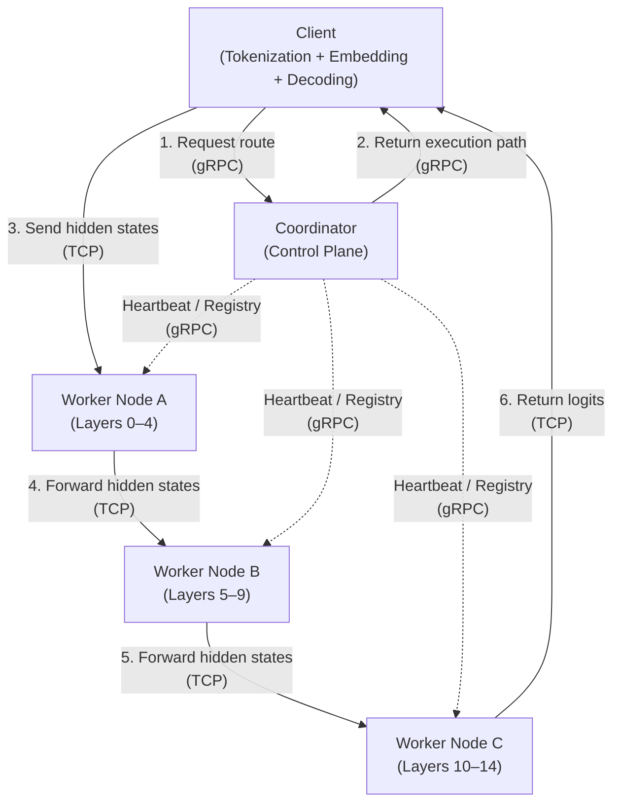

### Control Plane vs Data Plane Separation

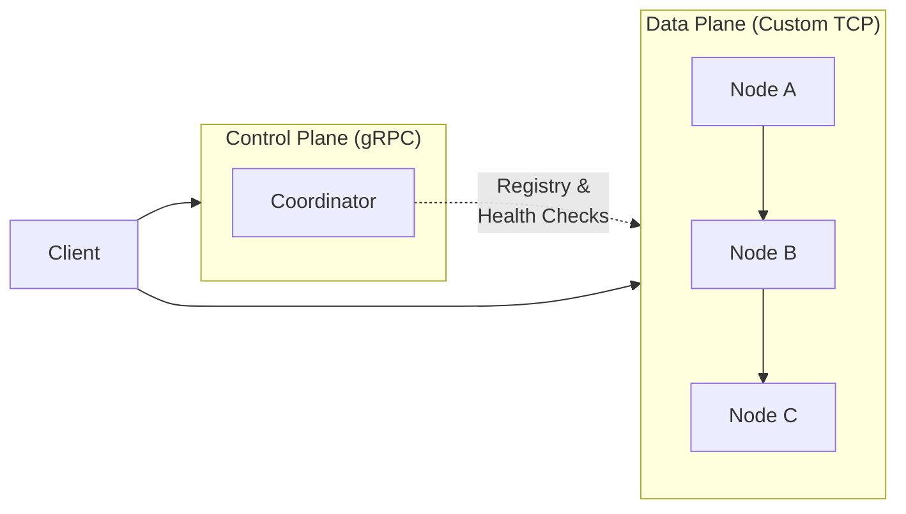

### Data Plane Internal Architecture (Focus Area)

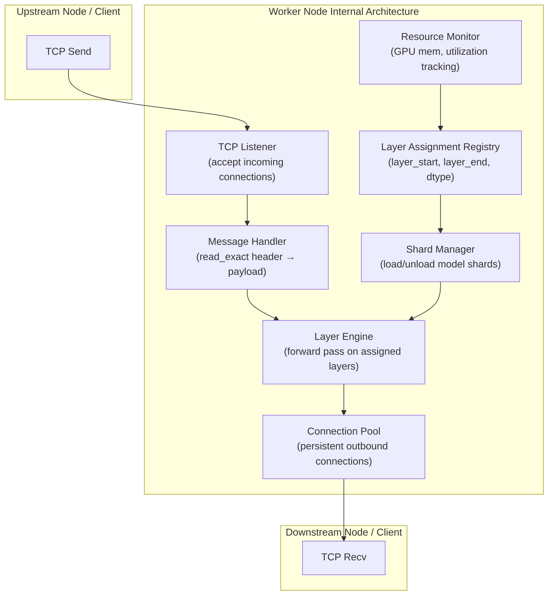

### Layer Assignment & Pipeline Topology

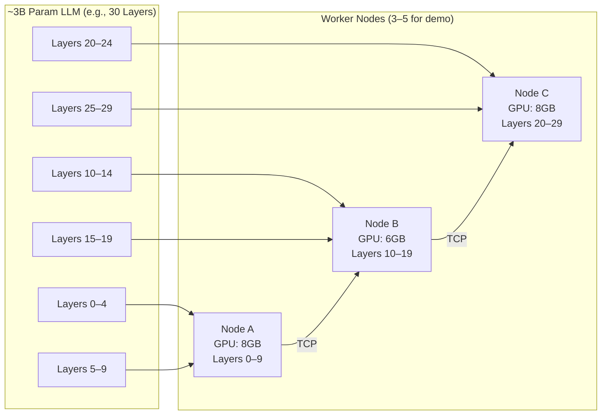

### Resource-Aware Layer Assignment Flow

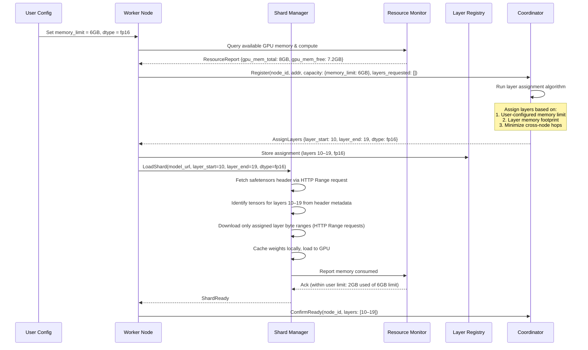

## Sequence Diagrams

### Main Inference Flow

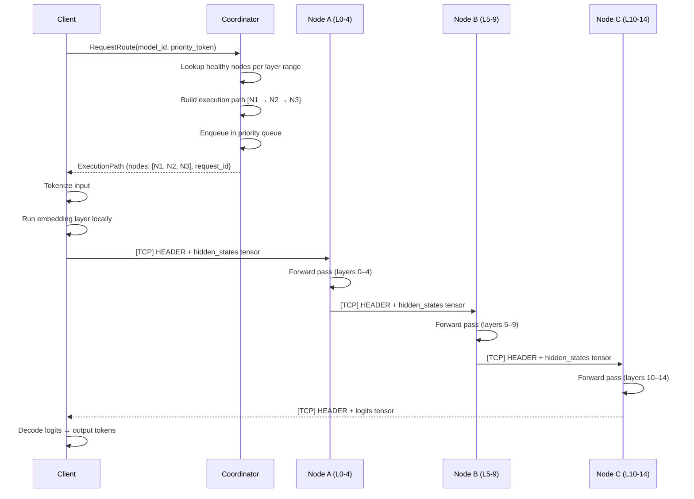

### Node Registration & Heartbeat

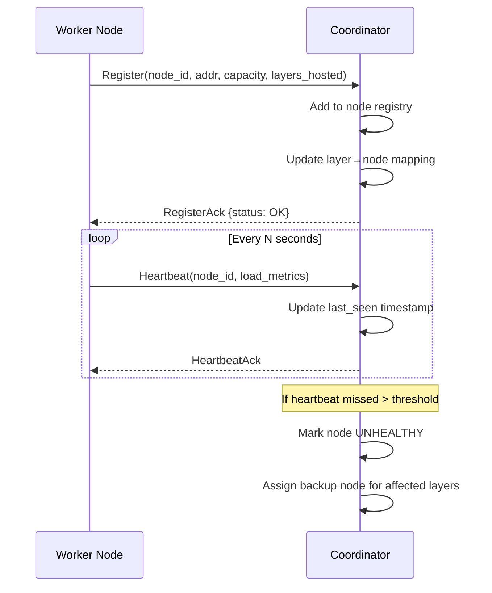

### Fault Tolerance (Reroute on Failure)

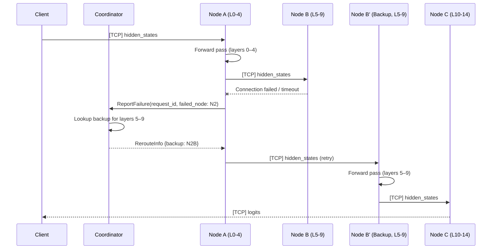


## Data Plane Orchestration (Primary Focus)

This section details the data plane internals — the layer assignment strategy, resource allocation model, tensor pipeline flow, and node lifecycle that this team owns.

### Layer Assignment Strategy

Layer assignment is static for the POC. The Coordinator computes assignments at cluster startup based on node capacity, but the Worker Nodes are responsible for accepting, loading, and validating their assignments.

**Assignment Algorithm (Coordinator-side, for context)**:
1. Collect all registered nodes with their `gpu_memory_free_mb`
2. Compute per-layer memory footprint: `layer_mem = model_total_mem / num_layers`
3. Greedily assign contiguous layer blocks to nodes, filling each node until its GPU memory would be exceeded
4. Ensure every layer is assigned to exactly one primary node
5. Assign backup nodes for each layer block (if spare capacity exists)

**Memory Estimation Per Layer (approximate for ~3B param model)**:

| Dtype | Per-Layer Memory (approx) | 5-Layer Block | 10-Layer Block |
| ----- | ------------------------- | ------------- | -------------- |
| fp16  | ~200 MB                   | ~1.0 GB       | ~2.0 GB        |
| int8  | ~100 MB                   | ~0.5 GB       | ~1.0 GB        |

**Activation Memory Overhead**: ~50–200 MB per in-flight request depending on sequence length and batch size. Must be accounted for in resource allocation.

**Constraints**:
- Each node gets a contiguous block of layers (no gaps, no interleaving)
- Layer blocks must not overlap between primary nodes
- A node must have sufficient free GPU memory for shard + activation overhead
- For POC: 3–5 nodes, 3–6 layers each, targeting full model coverage

### Resource Allocation Model

Each worker node operates within a user-configured memory budget. Users control how much GPU memory each node is allowed to use. The data plane does not make allocation decisions — it monitors usage and enforces the user-specified limits.

**Memory Budget Per Node (User-Configured)**:

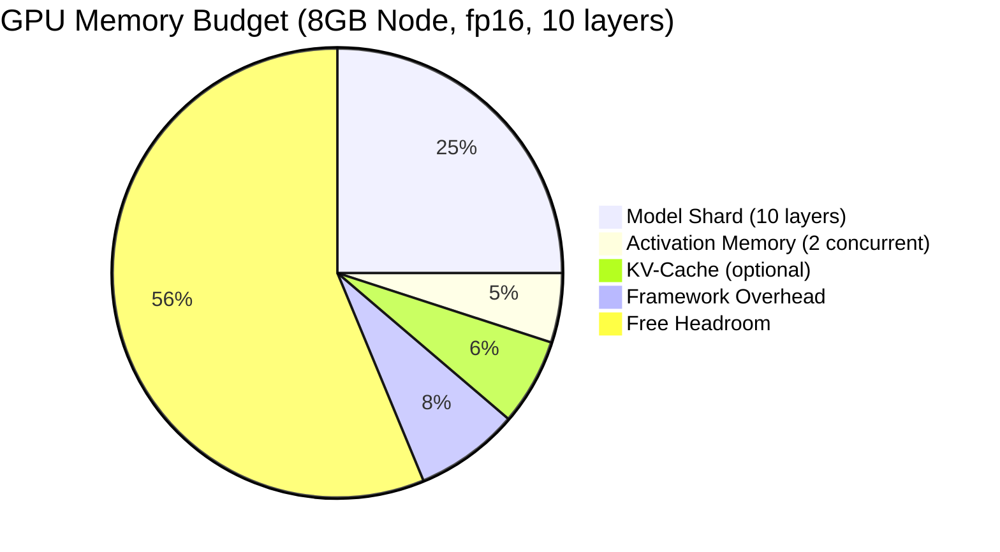

| Budget Category     | Who Controls       | Description                                                             |
| ------------------- | ------------------ | ----------------------------------------------------------------------- |
| Memory Limit        | User               | User sets max GPU memory this node may use                              |
| Model Shard         | Coordinator + User | Layer assignment determines shard size; user controls dtype (fp16/int8) |
| Activation Memory   | Automatic          | Determined by batch size, seq_len, hidden_dim at runtime                |
| KV-Cache (optional) | Automatic          | Grows with sequence length during autoregressive generation             |
| Framework Overhead  | Fixed              | PyTorch/CUDA context (~500–800 MB)                                      |

**Data Plane Responsibility**: Monitor actual usage against user-configured limit. Report overages via heartbeat. Do NOT autonomously adjust allocations.

**Capacity Check Before Accepting Assignment**:
`can_accept = (user_memory_limit - framework_overhead) >= (shard_memory + min_activation_memory)`

### Node-to-Node Tensor Pipeline

The core data plane operation: receiving a tensor, running a forward pass, and sending the result downstream.

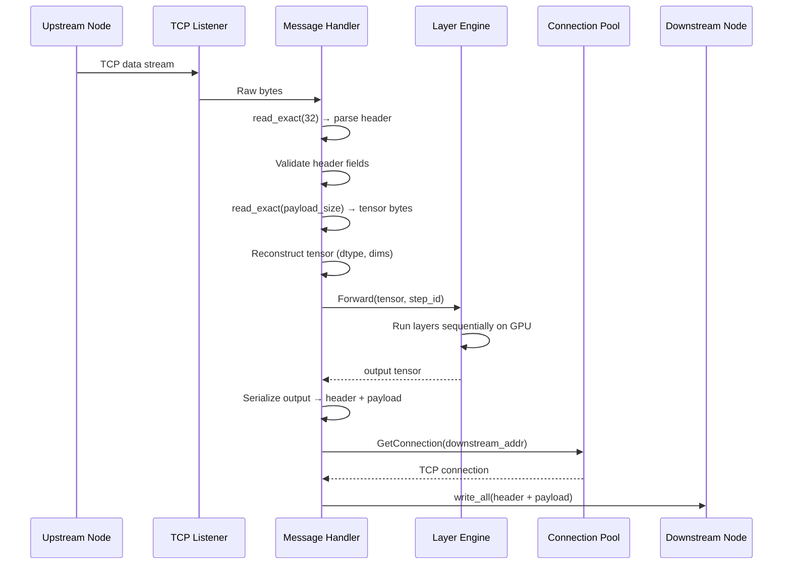

### Worker Node Lifecycle

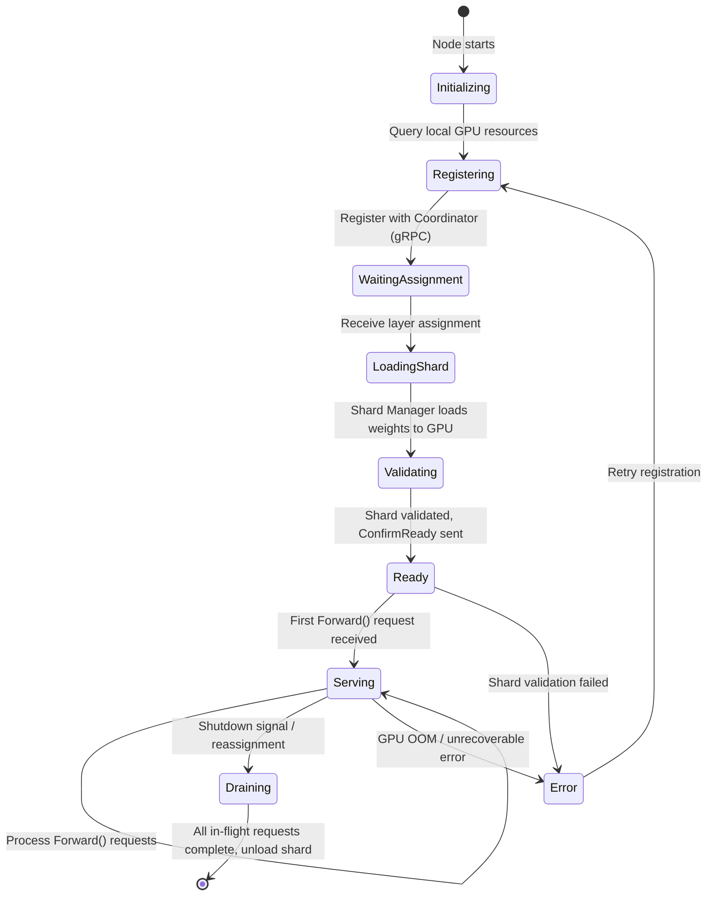

### Data Plane Error Recovery

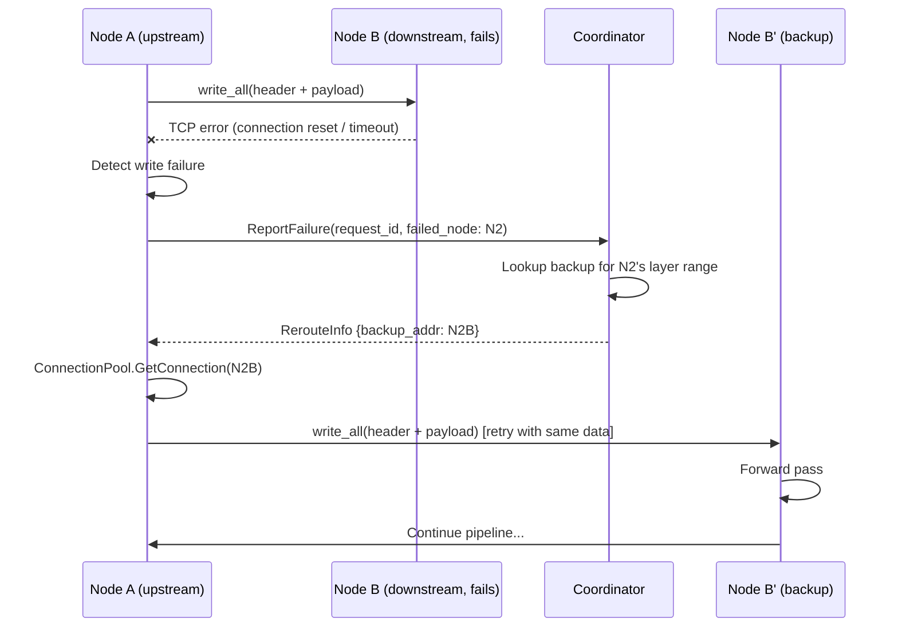

## Components and Interfaces

### Component 1: Coordinator

**Purpose**: Central control plane responsible for node lifecycle management, request scheduling, route computation, and fault tolerance orchestration. The Coordinator never touches inference data — it only manages metadata and routing decisions.

**Interface**:

| Method          | Input                                     | Output        | Description                                                       |
| --------------- | ----------------------------------------- | ------------- | ----------------------------------------------------------------- |
| `Register`      | node_id, address, capacity, layers_hosted | RegisterAck   | Adds a worker node to the registry and updates layer→node mapping |
| `Heartbeat`     | node_id, load_metrics                     | HeartbeatAck  | Updates node health status and last-seen timestamp                |
| `Deregister`    | node_id                                   | DeregisterAck | Removes node from registry, triggers backup reassignment          |
| `RequestRoute`  | model_id, priority_token                  | ExecutionPath | Builds ordered node list for inference pipeline, enqueues request |
| `ReportFailure` | request_id, failed_node_id                | RerouteInfo   | Returns backup node info for the failed node's layer range        |

**Responsibilities**:
- Maintain a live registry of all worker nodes and their hosted layer ranges
- Perform periodic health checks; mark nodes as UNHEALTHY after missed heartbeat threshold
- Build execution paths by mapping layer ranges to healthy nodes in order
- Manage a centralized priority queue using scoring: `priority = α * compute_contributed + β * wait_time`
- Assign and track backup nodes for each layer range (simple 1:1 backup)
- Expose gRPC endpoints for all control plane operations

**Internal State**:
- Node Registry (node_id → node metadata)
- Layer Map (layer_range → primary node, backup node)
- Priority Queue (sorted by priority score)
- Health Tracker (node_id → last_seen, status)

---

### Component 2: Worker Node (Data Plane — Primary Focus)

**Purpose**: Data plane unit that hosts a contiguous block of quantized transformer layers, executes forward passes on incoming hidden states, and forwards results to the next node in the pipeline via persistent TCP connections. This is the core component owned by this team.

**Interface**:

| Method                  | Transport               | Input                                   | Output                        | Description                                                   |
| ----------------------- | ----------------------- | --------------------------------------- | ----------------------------- | ------------------------------------------------------------- |
| `Forward`               | Custom TCP              | HEADER + hidden_states tensor           | HEADER + hidden_states tensor | Runs forward pass on hosted layers, sends output to next node |
| `Register`              | gRPC (to Coordinator)   | node_id, addr, capacity, layers         | RegisterAck                   | Self-registers with Coordinator on startup                    |
| `Heartbeat`             | gRPC (to Coordinator)   | node_id, load_metrics                   | HeartbeatAck                  | Periodic health signal                                        |
| `ConfirmReady`          | gRPC (to Coordinator)   | node_id, layers_loaded                  | Ack                           | Signals that shard is loaded and node is ready for inference  |
| `AcceptLayerAssignment` | gRPC (from Coordinator) | layer_start, layer_end, dtype, model_id | AssignmentAck                 | Receives layer assignment and triggers shard loading          |

**Responsibilities**:

- Load quantized model shard (fp16 or int8) for assigned layer range on startup
- Maintain persistent TCP connections to downstream node(s)
- Receive incoming tensor data: read fixed-size header first, then read exactly `payload_size` bytes (`read_exact` pattern)
- Execute forward pass through hosted transformer layers
- Forward output hidden states to next node, or return logits to client if final node
- Report failures to Coordinator when downstream node is unreachable
- Track local resource usage (GPU memory, utilization) and report via heartbeat
- Manage shard lifecycle: load, validate, and unload model shards

#### Worker Node Sub-Components

##### 2a. Shard Manager

**Purpose**: Manages the lifecycle of quantized model shards on the worker node — selectively downloading only the assigned layer weights from a safetensors model file via HTTP Range requests, caching them locally, loading into GPU memory, validating layer compatibility, and unloading when reassigned.

**Weight Download Strategy (Safetensors Selective Download)**:
The safetensors format stores a JSON header at the start of the file containing every tensor's name, dtype, shape, and exact byte offsets (`data_offsets`). This enables downloading only the specific layer weights a node needs, without fetching the full model file.

1. Fetch safetensors header via HTTP Range request (first 8 bytes → header size, then header JSON — typically ~100KB)
2. Parse tensor metadata to identify tensors belonging to assigned layers (e.g., `model.layers.5.self_attn.q_proj.weight` through `model.layers.9.*`)
3. Download only those tensor byte ranges using HTTP Range requests (provider-agnostic: works with HuggingFace Hub, S3, GCS, or any HTTP server)
4. Cache downloaded weights locally to avoid re-downloading on restart
5. Load cached weights into GPU memory

| Operation       | Description                                                                                                                                                                     |
| --------------- | ------------------------------------------------------------------------------------------------------------------------------------------------------------------------------- |
| `LoadShard`     | Selectively download assigned layer weights via HTTP Range requests, cache locally, load to GPU. Validates dtype (fp16/int8), allocates GPU memory, and moves tensors to device |
| `UnloadShard`   | Free GPU memory for current shard. Used during reassignment or shutdown                                                                                                         |
| `ValidateShard` | Verify loaded shard matches expected layer count, hidden dimensions, and dtype                                                                                                  |
| `GetShardInfo`  | Return metadata: layers loaded, memory consumed, dtype, model_id, download progress                                                                                             |

**State**:
- Loaded model layers (ordered list of transformer blocks)
- Shard metadata (model_id, model_url, layer_range, dtype, memory_footprint_mb)
- Load status (UNLOADED, DOWNLOADING, LOADING, READY, ERROR)
- Local cache directory for downloaded weights

##### 2b. Resource Monitor

**Purpose**: Tracks GPU memory, compute utilization, and active request count on the local node. Feeds data to heartbeat reports and reports current resource state. Memory allocation limits are user-configured — the data plane does not decide how much memory to use, it only monitors and reports.

| Metric               | Type    | Description                                                |
| -------------------- | ------- | ---------------------------------------------------------- |
| gpu_memory_total_mb  | uint32  | Total GPU memory available                                 |
| gpu_memory_used_mb   | uint32  | Current GPU memory in use (shard + activations + KV-cache) |
| gpu_memory_free_mb   | uint32  | Remaining GPU memory                                       |
| gpu_memory_limit_mb  | uint32  | User-configured memory limit for this node                 |
| gpu_utilization      | float32 | GPU compute utilization (0.0–1.0)                          |
| active_requests      | uint16  | Number of forward passes currently in-flight               |
| shard_memory_mb      | uint32  | Memory consumed by loaded model shard                      |
| activation_memory_mb | uint32  | Estimated memory for in-flight activations                 |

**Responsibilities**:
- Poll GPU metrics at configurable interval (e.g., every 1 second)
- Report current resource usage (does NOT decide allocation — that is user-controlled)
- Provide resource snapshot for heartbeat messages
- Alert if actual usage exceeds user-configured memory limit

##### 2c. Layer Assignment Registry

**Purpose**: Stores the current layer assignment for this node and provides lookup for pipeline routing decisions.

| Field           | Type               | Description                                              |
| --------------- | ------------------ | -------------------------------------------------------- |
| node_id         | string (UUID)      | This node's identifier                                   |
| model_id        | string             | Model being served                                       |
| model_url       | string (URL)       | HTTP URL to the safetensors model file                   |
| layer_start     | uint16             | First assigned layer (inclusive)                         |
| layer_end       | uint16             | Last assigned layer (inclusive)                          |
| dtype           | enum (fp16, int8)  | Quantization format for this shard                       |
| is_final_node   | bool               | Whether this node hosts the last layers in the model     |
| downstream_node | string (host:port) | TCP address of the next node in pipeline (null if final) |
| upstream_nodes  | list of string     | TCP addresses that may send data to this node            |

##### 2d. Connection Pool

**Purpose**: Manages persistent TCP connections to downstream nodes and accepts incoming connections from upstream nodes. Connections are established once and reused across requests.

| Operation                      | Description                                                                     |
| ------------------------------ | ------------------------------------------------------------------------------- |
| `GetConnection(target_addr)`   | Return existing connection or establish new persistent TCP connection to target |
| `CloseConnection(target_addr)` | Gracefully close connection to a specific peer                                  |
| `CloseAll`                     | Close all connections (shutdown)                                                |
| `IsConnected(target_addr)`     | Check if a live connection exists to target                                     |
| `AcceptIncoming`               | Accept new inbound TCP connection from upstream node or client                  |

**Connection Lifecycle**:

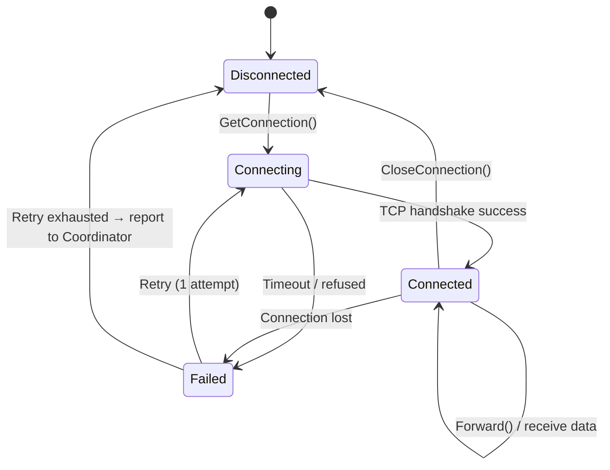

**Design Decisions**:
- One TCP connection per node pair (not per request)
- Blocking I/O acceptable for POC (simplifies implementation)
- No connection multiplexing — sequential request processing per connection
- Connection timeout: 5 seconds for establishment, 30 seconds for idle

##### 2e. Message Handler

**Purpose**: Implements the custom TCP binary protocol. Responsible for reading/writing the 32-byte header and variable-length payload with correct framing.

**Read Flow**:
1. `read_exact(32)` — read the fixed-size header
2. Parse header fields (message_type, request_id, step_id, payload_size, dtype, num_dims, dims)
3. Validate header: payload_size > 0, dtype ∈ {1, 2}, num_dims ≤ 4, dims consistent with payload_size
4. `read_exact(payload_size)` — read the tensor payload
5. Reconstruct tensor from raw bytes using dtype and dims

**Write Flow**:
1. Serialize tensor to contiguous raw bytes
2. Compute payload_size, extract dims from tensor shape
3. Pack header (32 bytes, fixed layout)
4. `write_all(header + payload)` — send as single write

**Critical Implementation Detail — `read_exact`**:
TCP is a stream protocol. A single `recv()` call may return fewer bytes than requested. The `read_exact(n)` function must loop, accumulating bytes until exactly `n` bytes have been read or an error/EOF occurs. This is the most critical correctness requirement in the data plane.

##### 2f. Layer Engine

**Purpose**: Executes the forward pass through the locally hosted transformer layers. Takes input hidden states, runs them through each layer sequentially, and produces output hidden states (or logits if final node).

| Operation | Input                         | Output                           | Description                                                                    |
| --------- | ----------------------------- | -------------------------------- | ------------------------------------------------------------------------------ |
| `Forward` | hidden_states tensor, step_id | hidden_states tensor (or logits) | Sequential forward pass through all hosted layers                              |
| `WarmUp`  | dummy tensor                  | —                                | Run a dummy forward pass to warm up GPU kernels and allocate activation memory |

**Forward Pass Flow**:

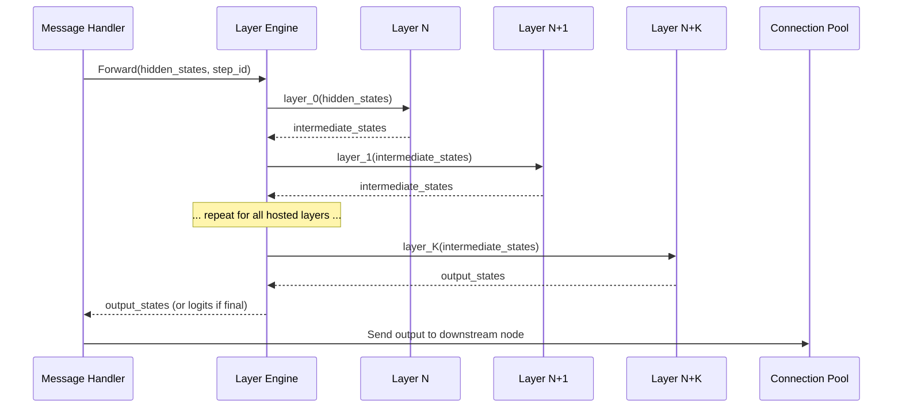

**Internal State**:
- Loaded model layers (ordered list of transformer blocks on GPU)
- Layer count (number of layers hosted)
- is_final (if true, apply final LM head to produce logits)

**Worker Node Overall Internal State**:
- Shard Manager state (loaded layers, metadata)
- Resource Monitor state (GPU metrics)
- Layer Assignment Registry (assignment details)
- Connection Pool (active connections)
- Node identity (node_id, addresses)

---

### Component 3: Client

**Purpose**: Entry point for inference requests. Handles tokenization, embedding computation, route acquisition from Coordinator, and final output decoding. The Client is responsible for initiating the pipeline and receiving the final result.

**Interface**:

| Method             | Description                                                                             |
| ------------------ | --------------------------------------------------------------------------------------- |
| `SubmitInference`  | End-to-end: tokenize → embed → get route → send to first node → receive logits → decode |
| `RequestRoute`     | gRPC call to Coordinator to obtain execution path                                       |
| `SendHiddenStates` | TCP send of initial hidden states to first pipeline node                                |
| `ReceiveLogits`    | TCP receive of final logits from last pipeline node                                     |

**Responsibilities**:
- Tokenize raw text input into token IDs
- Run embedding layer locally to produce initial hidden states tensor
- Request execution path from Coordinator via gRPC
- Send initial hidden states to first node in the execution path via TCP
- Listen for final logits from the last node in the pipeline
- Decode logits into output text

---

### Component 4: Priority Queue (Coordinator Sub-component)

**Purpose**: Orders incoming inference requests based on a scoring function that rewards compute contributors and accounts for wait time.

**Scoring Function**: `priority_score = α * compute_contributed + β * wait_time`

| Parameter           | Description                                                        | Suggested Default |
| ------------------- | ------------------------------------------------------------------ | ----------------- |
| α                   | Weight for compute contribution                                    | 0.7               |
| β                   | Weight for wait time fairness                                      | 0.3               |
| compute_contributed | Cumulative compute units the requester has contributed as a worker | —                 |
| wait_time           | Time elapsed since request was enqueued (seconds)                  | —                 |

**Responsibilities**:
- Enqueue incoming requests with initial priority score
- Periodically re-score queued requests (wait_time increases over time)
- Dequeue highest-priority request when pipeline capacity is available
- Provide queue depth and wait time estimates

## Data Models

### Node Registration Record

| Field                  | Type               | Description                            |
| ---------------------- | ------------------ | -------------------------------------- |
| node_id                | string (UUID)      | Unique identifier for the worker node  |
| address                | string (host:port) | Network address for TCP data plane     |
| grpc_address           | string (host:port) | Network address for gRPC control plane |
| capacity               | object             | Compute capacity descriptor            |
| capacity.gpu_memory_mb | uint32             | Available GPU memory in MB             |
| capacity.compute_units | float32            | Relative compute power metric          |
| layers_hosted          | object             | Layer range hosted by this node        |
| layers_hosted.start    | uint16             | First layer index (inclusive)          |
| layers_hosted.end      | uint16             | Last layer index (inclusive)           |
| status                 | enum               | HEALTHY, UNHEALTHY, DRAINING           |
| last_seen              | timestamp          | Last heartbeat timestamp               |
| registered_at          | timestamp          | Registration timestamp                 |

### Execution Path

| Field                | Type               | Description                                       |
| -------------------- | ------------------ | ------------------------------------------------- |
| request_id           | uint32             | Unique request identifier                         |
| model_id             | string             | Target model identifier                           |
| nodes                | ordered list       | Ordered list of node descriptors for the pipeline |
| nodes[i].node_id     | string             | Node identifier                                   |
| nodes[i].address     | string (host:port) | TCP address for data plane                        |
| nodes[i].layer_start | uint16             | First layer this node processes                   |
| nodes[i].layer_end   | uint16             | Last layer this node processes                    |
| backup_nodes         | map                | layer_range → backup node descriptor              |
| created_at           | timestamp          | When the path was computed                        |

### TCP Message Format (Data Plane — Detailed)

#### Protocol Overview

The data plane uses a custom binary protocol optimized for minimal overhead. No serialization libraries (JSON, Protobuf, MessagePack) are used. Tensors are transmitted as raw contiguous memory with a fixed-size header for framing.

**Design Principles**:
- Fixed 32-byte header for predictable parsing (no variable-length header fields)
- Zero-copy friendly: payload is raw tensor bytes matching GPU memory layout
- No compression: quantization (fp16/int8) is the size reduction strategy
- Framing via `payload_size` field: receiver always knows exactly how many bytes to read

#### Header (Fixed 32 bytes)

| Offset | Field        | Size    | Type   | Values / Description                                                     |
| ------ | ------------ | ------- | ------ | ------------------------------------------------------------------------ |
| 0      | message_type | 1 byte  | uint8  | 1=FORWARD, 2=RESULT, 3=ERROR, 4=HEARTBEAT_DATA                           |
| 1      | request_id   | 4 bytes | uint32 | Unique request identifier (matches Coordinator-assigned ID)              |
| 5      | step_id      | 4 bytes | uint32 | Token generation step (0 for first token, increments for autoregressive) |
| 9      | payload_size | 4 bytes | uint32 | Exact size of payload in bytes. Max ~16MB for POC                        |
| 13     | dtype        | 1 byte  | uint8  | 1=fp16 (2 bytes/element), 2=int8 (1 byte/element)                        |
| 14     | num_dims     | 1 byte  | uint8  | Number of tensor dimensions (1–4)                                        |
| 15     | dims[0]      | 4 bytes | uint32 | Dimension 0 (e.g., batch_size)                                           |
| 19     | dims[1]      | 4 bytes | uint32 | Dimension 1 (e.g., seq_len)                                              |
| 23     | dims[2]      | 4 bytes | uint32 | Dimension 2 (e.g., hidden_dim)                                           |
| 27     | dims[3]      | 4 bytes | uint32 | Dimension 3 (unused → 0)                                                 |
| 31     | reserved     | 1 byte  | uint8  | Padding / future use                                                     |

**Header Validation Rules**:
- `message_type` ∈ {1, 2, 3, 4}
- `payload_size` must equal `product(dims[0:num_dims]) * dtype_size(dtype)`
- `dtype` ∈ {1, 2}
- `num_dims` ∈ {1, 2, 3, 4}
- `dims[i]` > 0 for i < num_dims, `dims[i]` = 0 for i ≥ num_dims

#### Payload

| Field       | Type      | Description                                                                                                                                                                                                      |
| ----------- | --------- | ---------------------------------------------------------------------------------------------------------------------------------------------------------------------------------------------------------------- |
| tensor_data | raw bytes | Contiguous tensor data in row-major (C-contiguous) order. Size = payload_size. Memory layout must match dtype and dims exactly. For fp16: little-endian IEEE 754 half-precision. For int8: signed 8-bit integers |

#### Typical Message Sizes

| Scenario                      | Shape          | Dtype | Header | Payload | Total   |
| ----------------------------- | -------------- | ----- | ------ | ------- | ------- |
| Single token, hidden_dim=4096 | [1, 1, 4096]   | fp16  | 32 B   | 8 KB    | ~8 KB   |
| 128 token sequence            | [1, 128, 4096] | fp16  | 32 B   | 1 MB    | ~1 MB   |
| 128 token sequence            | [1, 128, 4096] | int8  | 32 B   | 512 KB  | ~512 KB |
| Batch of 4, 128 tokens        | [4, 128, 4096] | fp16  | 32 B   | 4 MB    | ~4 MB   |

### Inference Request (Priority Queue Entry)

| Field               | Type      | Description                                                |
| ------------------- | --------- | ---------------------------------------------------------- |
| request_id          | uint32    | Unique request identifier                                  |
| model_id            | string    | Target model                                               |
| client_id           | string    | Requesting client identifier                               |
| priority_score      | float32   | Computed priority: α * compute_contributed + β * wait_time |
| compute_contributed | float32   | Cumulative compute units contributed by this client        |
| enqueued_at         | timestamp | When the request entered the queue                         |
| status              | enum      | QUEUED, DISPATCHED, IN_PROGRESS, COMPLETED, FAILED         |

### Heartbeat Message

| Field                        | Type          | Description                               |
| ---------------------------- | ------------- | ----------------------------------------- |
| node_id                      | string (UUID) | Node identifier                           |
| timestamp                    | timestamp     | Current time on the node                  |
| load_metrics                 | object        | Current load information                  |
| load_metrics.gpu_utilization | float32       | GPU utilization percentage (0–1)          |
| load_metrics.memory_used_mb  | uint32        | Current GPU memory usage                  |
| load_metrics.active_requests | uint16        | Number of in-flight requests on this node |


## Error Handling

### Error Scenario 1: Worker Node Failure Mid-Pipeline

**Condition**: A worker node becomes unreachable (TCP connection refused/timeout) while a request is in-flight. The upstream node detects the failure when attempting to forward hidden states.

**Response**: The upstream node reports the failure to the Coordinator via gRPC `ReportFailure`. The Coordinator looks up the backup node for the failed node's layer range and returns reroute information.

**Recovery**: The upstream node establishes a TCP connection to the backup node and retransmits the hidden states. If the backup is also unavailable, the request fails fast and the client receives an error. For POC, a single retry attempt is sufficient.

### Error Scenario 2: Worker Node Fails Health Check

**Condition**: The Coordinator detects that a node has missed heartbeats beyond the configured threshold (e.g., 3 consecutive misses at 5-second intervals).

**Response**: The Coordinator marks the node as UNHEALTHY in the registry and removes it from active route computation. Any layer ranges solely served by this node trigger backup activation.

**Recovery**: The node is excluded from new execution paths. If the node recovers and resumes heartbeats, it transitions back to HEALTHY after a stabilization period. Existing in-flight requests on the failed node are not recovered (fail-fast for POC).

### Error Scenario 3: Partial TCP Read

**Condition**: A node receives fewer bytes than expected when reading the header or payload (common with TCP streaming).

**Response**: The receiving node continues reading in a loop (`read_exact` pattern) until exactly the expected number of bytes are received or a timeout/EOF occurs.

**Recovery**: If the full message cannot be assembled within a timeout window, the connection is considered broken. The node reports failure to the Coordinator and the request follows the reroute path.

### Error Scenario 4: Priority Queue Overflow

**Condition**: The number of queued requests exceeds a configured maximum (e.g., 100 for POC).

**Response**: New requests are rejected with a QUEUE_FULL error. The client receives immediate feedback.

**Recovery**: Clients can retry after a backoff period. The queue drains naturally as pipeline capacity becomes available.

### Error Scenario 5: Invalid Tensor Dimensions

**Condition**: A node receives a message where the header's dims/dtype don't match expected tensor shape for its layer input.

**Response**: The node logs the mismatch and returns an ERROR message type back to the sender via TCP.

**Recovery**: The request is marked as FAILED. The client receives an error indicating a tensor shape mismatch. No retry is attempted (this indicates a bug, not a transient failure).

## Testing Strategy

### Unit Testing Approach

**Data Plane (Primary Focus)**:

- **Message Handler**: Header packing/unpacking round-trip correctness, `read_exact` with simulated partial reads (1 byte at a time, random chunk sizes), header validation rejects invalid fields (bad dtype, dims mismatch, zero payload_size)
- **Shard Manager**: Load/unload shard lifecycle, memory accounting after load matches expected footprint, validation catches dtype mismatch or wrong layer count
- **Resource Monitor**: GPU metric polling returns sane values, capacity check correctly accepts/rejects assignments based on available memory
- **Connection Pool**: Connection reuse (same target returns same connection), graceful handling of closed connections, connection establishment timeout
- **Layer Engine**: Forward pass output shape matches expected dimensions, output is non-NaN and non-Inf for valid input, warm-up allocates expected activation memory

**Coordinator (Context — other team)**:
- Node registration/deregistration, heartbeat tracking, execution path building, priority queue scoring

**Client (Context — other team)**:
- Tokenization, embedding, route parsing, logit decoding

### Property-Based Testing Approach

**Data Plane Properties (Primary Focus)**:

- **TCP Framing Round-Trip**: For any tensor of valid dtype ∈ {fp16, int8} and dimensions where each dim ∈ [1, 1024], serializing to the binary protocol and deserializing must produce a bitwise-identical tensor
- **Header Size Invariant**: Every serialized header must be exactly 32 bytes regardless of message_type, dims, or dtype
- **Header Validation Completeness**: For any header with at least one invalid field, validation must reject it. For any header with all valid fields, validation must accept it
- **Payload Size Consistency**: For any valid header, `payload_size == product(dims[0:num_dims]) * dtype_size(dtype)`
- **Connection Pool Idempotency**: Calling `GetConnection(addr)` twice for the same address returns the same connection object
- **Resource Monitor Monotonicity**: After loading a shard, `gpu_memory_free` must decrease by at least `shard_memory_mb`

**System-Wide Properties (Context)**:
- Execution path covers every layer exactly once in order
- Priority queue dequeue always returns highest-priority request

### Integration Testing Approach

**Data Plane Integration (Primary Focus)**:

- **Two-Node Pipeline**: Stand up 2 worker nodes, send a tensor through Node A → Node B, verify output shape and non-NaN values
- **Full Pipeline**: 3-node cluster, end-to-end tensor flow, verify final output matches single-machine inference (within quantization tolerance)
- **Fault Injection**: Kill downstream node mid-transfer, verify upstream detects failure and reports to Coordinator
- **Partial Read Stress**: Introduce artificial delays in TCP reads, verify `read_exact` assembles complete messages correctly
- **Memory Pressure**: Load shard near GPU memory limit, verify Resource Monitor correctly reports low headroom and rejects additional assignments

## Performance Considerations

- **Tensor Transfer Overhead**: The custom TCP protocol avoids serialization overhead (no JSON/Protobuf). Raw tensor transfer at fp16 for a hidden state of shape [1, 128, 4096] is ~1MB per hop — acceptable on local/LAN networks
- **Persistent Connections**: TCP connections between nodes are established once and reused, eliminating connection setup latency per request
- **Quantization**: int8 quantization halves transfer size vs fp16 at the cost of some precision. For hackathon demo, fp16 is the safe default; int8 is an optimization lever
- **Pipeline Parallelism**: Multiple requests can be in-flight simultaneously across different pipeline stages. Node A can process request 2 while Node B processes request 1
- **KV-Cache Locality**: Keeping KV-cache on the same nodes across token generation steps avoids cache invalidation. This is an optional optimization — for POC, stateless forward passes are acceptable
- **Blocking I/O**: Acceptable for POC with low concurrency. For higher throughput, async I/O (e.g., asyncio, tokio) would be needed

## Security Considerations

- **Non-Goal for POC**: Strong security is explicitly out of scope. The system assumes a trusted network (hackathon LAN or VPN)
- **No Authentication**: Nodes and clients are not authenticated. Any node can register with the Coordinator
- **No Encryption**: TCP data plane traffic is unencrypted. Tensor data is transmitted in plaintext
- **Minimal Input Validation**: Header fields are validated for basic sanity (e.g., payload_size > 0, valid dtype), but no deep validation is performed
- **Future Considerations**: For production, add mTLS for node-to-node communication, JWT-based client authentication, and input sanitization

## Dependencies

| Dependency                                       | Purpose                                                   | Component                    |
| ------------------------------------------------ | --------------------------------------------------------- | ---------------------------- |
| gRPC framework (e.g., grpcio, tonic)             | Control plane communication between Coordinator and Nodes | Coordinator, Worker Nodes    |
| Protobuf                                         | gRPC service definitions for control plane                | Coordinator, Worker Nodes    |
| PyTorch / ONNX Runtime                           | Model loading, quantization, forward pass execution       | Worker Nodes                 |
| safetensors                                      | Parsing safetensors file headers and tensor metadata      | Worker Nodes (Shard Manager) |
| requests                                         | HTTP Range requests for selective weight download         | Worker Nodes (Shard Manager) |
| Tokenizer library (e.g., HuggingFace tokenizers) | Tokenization and embedding                                | Client                       |
| TCP sockets (stdlib)                             | Custom binary protocol for data plane                     | Worker Nodes, Client         |
| Threading / async runtime                        | Concurrent request handling                               | Worker Nodes                 |
| Priority queue (stdlib)                          | Request scheduling                                        | Coordinator                  |
| UUID generator (stdlib)                          | Node and request identification                           | All components               |


---

## App Layer (CLI + Dashboard)

This section documents the user-facing application layer built on top of the distributed inference system. The app layer provides the CLI tool and web dashboard that end users interact with.

### What is Built

The `meshrun/app/` folder contains the complete CLI and dashboard for MeshRun.

**CLI tool**: `meshrun` (installed via `pip install -e meshrun/app/`)

**Commands**:
- `meshrun submit "<prompt>"` — runs inference, streams output token by token
- `meshrun submit "<prompt>" --async` — queues job, returns job ID
- `meshrun submit --job-id <id>` — retrieves async job result
- `meshrun status` — shows network health and queue
- `meshrun nodes` — lists all nodes with status, layers, credits, latency
- `meshrun credits` — shows credit balance, priority score, history
- `meshrun join` — interactive onboarding to register this machine as a worker
- `meshrun leave` — gracefully deregisters this machine
- `meshrun dashboard` — launches web dashboard at http://127.0.0.1:7654

**Dashboard**: FastAPI server + D3.js frontend
- WebSocket endpoint: `ws://127.0.0.1:7654/ws`
- Expects events from coordinator in this format (see `app/dashboard/events.py` for full schema):
  - `{ type: "job_started", job_id, prompt_preview, route, timestamp }`
  - `{ type: "job_hop", job_id, from_node, to_node, latency_ms, timestamp }`
  - `{ type: "job_complete", job_id, tokens, total_latency, cost_saved_usd, co2_avoided_g, timestamp }`
  - `{ type: "node_status", node_id, status, latency_ms, timestamp }`
  - `{ type: "queue_update", depth, timestamp }`
  - `{ type: "stats_update", total_tokens, total_cost_saved_usd, total_co2_avoided_g, timestamp }`

### App Layer Architecture

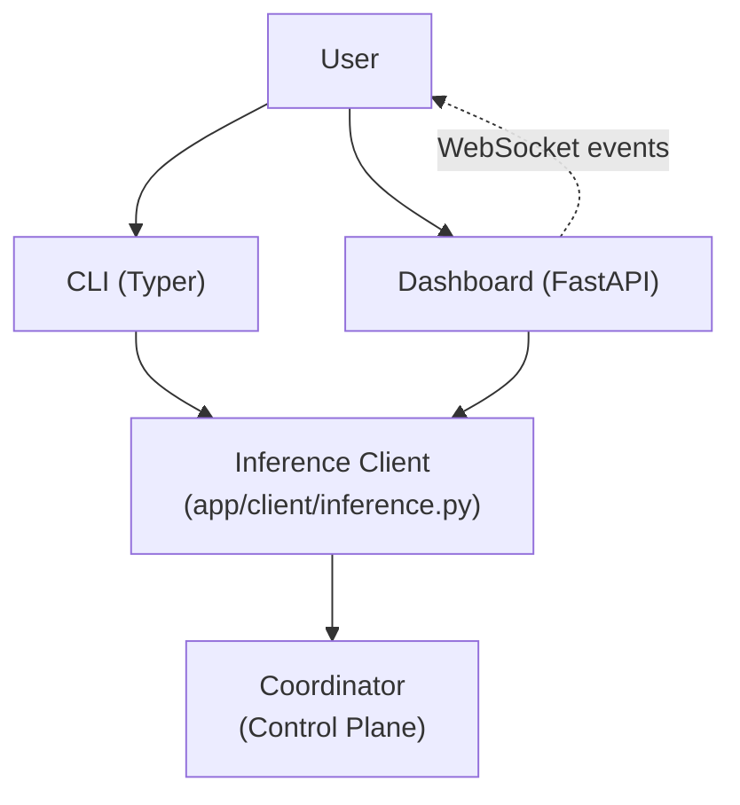

### Integration Points (Stubs to Replace)

All backend calls live in `app/client/inference.py`. Every function is marked `# TODO: replace with real coordinator call`.

| Function | Purpose | Coordinator Endpoint |
|----------|---------|---------------------|
| `get_routing_path(prompt)` | Get execution path for a prompt | `RequestRoute` |
| `submit_inference_job(prompt, priority)` | Synchronous inference | `RequestRoute` + data plane |
| `submit_async_job(prompt, priority)` | Queue job for async processing | Priority Queue enqueue |
| `get_job_result(job_id)` | Retrieve async job result | Job status lookup |
| `register_node(node_id, layers, vram_gb)` | Register as worker | `Register` RPC |
| `deregister_node(node_id)` | Leave the mesh | `Deregister` RPC |
| `get_network_status()` | Fetch nodes and queue | Registry + Queue status |
| `get_credits(node_id)` | Fetch credit balance | Credit ledger |
| `detect_local_hardware()` | Detect GPU/RAM | Local (torch/psutil) |

The coordinator URL is configured via `app/config.py` (default: `http://localhost:8000`).

The dashboard websocket currently uses mock events from `app/dashboard/events.py`. Replace `mock_event_stream()` with a real websocket subscription to the coordinator.

### CLI Implementation Status

| Command | File | Status |
|---------|------|--------|
| submit | `app/cli/commands/submit.py` | ✅ Implemented (mock backend) |
| status | `app/cli/commands/status.py` | ✅ Implemented (mock backend) |
| nodes | `app/cli/commands/nodes.py` | ✅ Implemented (mock backend) |
| credits | `app/cli/commands/credits.py` | ✅ Implemented (mock backend) |
| join | `app/cli/commands/join.py` | ✅ Implemented (mock backend) |
| leave | `app/cli/commands/leave.py` | ✅ Implemented (mock backend) |
| dashboard | `app/cli/commands/dashboard.py` | ✅ Implemented (mock events) |

### Dashboard Implementation Status

| Component | File | Status |
|-----------|------|--------|
| Event stream | `app/dashboard/events.py` | ✅ Mock event generator |
| FastAPI server | `app/dashboard/server.py` | ✅ WebSocket + static files |
| HTML | `app/dashboard/static/index.html` | ✅ Complete |
| CSS | `app/dashboard/static/style.css` | ✅ Dark theme |
| JavaScript | `app/dashboard/static/main.js` | ✅ D3 graph + live feed |

### Dependencies

```
pip install -e meshrun/app/
```

Requires: typer, rich, fastapi, uvicorn, websockets, httpx, pydantic, pydantic-settings

### Running Locally

```bash
# Run inference
meshrun submit "hello world"

# Launch dashboard
meshrun dashboard
```


---

## Kiro Extension

### What is built
A Kiro/VS Code extension in meshrun/kiro-extension/ that surfaces the MeshRun CLI and dashboard natively inside Kiro IDE.

### Features
- Activity bar icon with two sidebar tree views:
  - Nodes: shows each worker node with status, layer range, latency, credits
  - Credits: shows balance, GPU hours contributed, priority score, cost saved, CO2 avoided
- Refresh button on nodes sidebar
- Status bar item bottom-left: "MeshRun" — click opens dashboard
- Command Palette (Cmd+Shift+P → "MeshRun:"):
  - MeshRun: Submit Inference Job — input box prompt, QuickPick sync/async
  - MeshRun: Show Network Status
  - MeshRun: List Nodes
  - MeshRun: Show Credits
  - MeshRun: Join Mesh as Worker — confirmation dialog
  - MeshRun: Leave Mesh — confirmation dialog
  - MeshRun: Open Dashboard — D3 dashboard as Kiro webview tab

### Architecture
- src/extension.ts       — activation entry point
- src/commands.ts        — all command registrations
- src/meshrunProcess.ts  — child_process.spawn wrapper, streams to Output Channel
- src/dashboard.ts       — WebviewPanel iframing the FastAPI server
- src/sidebar.ts         — TreeDataProviders for nodes and credits

### How it works
All commands call the existing meshrun CLI via child_process.spawn. Output streams to the MeshRun Output Channel in real time. Dashboard opens as a Kiro webview tab, iframing http://127.0.0.1:7654. FastAPI server is started automatically when dashboard command is triggered.

### Integration notes
Sidebar mock data in sidebar.ts — TODO replace with coordinator HTTP call. meshrunProcess.ts can be updated to call coordinator directly instead of CLI. The extension works in both Kiro and standard VS Code since Kiro is VS Code based.

### To run in development
```bash
cd meshrun/kiro-extension
npm install
npm run compile
```
Then press F5 in Kiro/VS Code to launch Extension Development Host.
