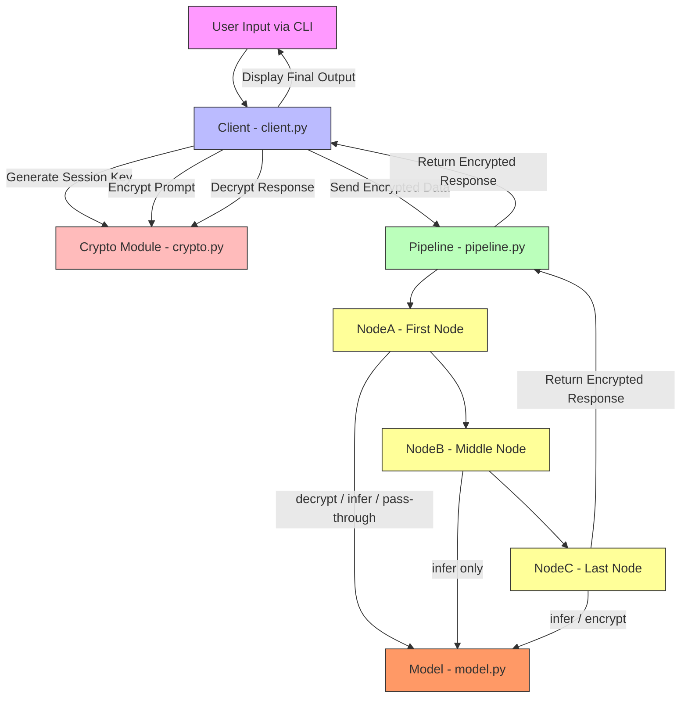
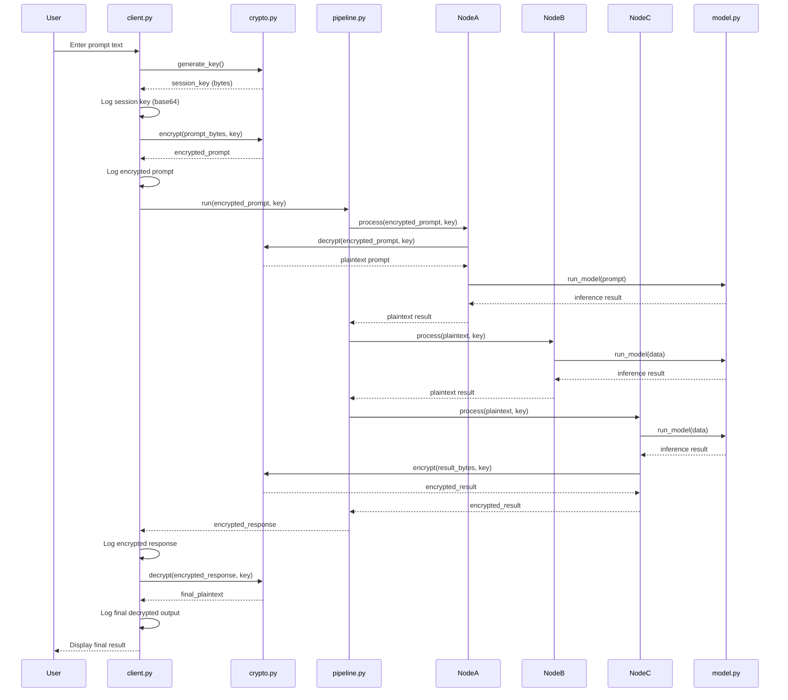

# Design Document: Secure Inference Pipeline

## Overview

This feature implements a standalone CLI-based testbed for the security layer of a larger distributed inference pipeline project. The system simulates three processing nodes (NodeA, NodeB, NodeC) connected in a linear pipeline, where data is encrypted at ingress, decrypted and processed at each node, and re-encrypted at egress. The entire lifecycle — encrypt → decrypt → process → encrypt → decrypt — runs locally via function calls with no networking involved.

This serves as the initial PRD and proof-of-concept for the security layer component. The goal is to validate the encrypt/decrypt flow in isolation before coordinating with teammates to integrate it into the main distributed inference system. By keeping the security layer self-contained and well-tested, it can later be dropped into the production pipeline with minimal changes — the `crypto.py` module and `Node.process()` security logic are designed to be portable.

Every cryptographic and inference operation is logged to the CLI with full transparency so the team can review and verify the security flow. The system uses `cryptography.fernet` for symmetric encryption with a single session key generated per invocation. No external APIs, no real ML models, and no network transport are used at this stage — the focus is purely on proving the security layer works correctly.

## Architecture



## Sequence Diagrams

### Main Pipeline Flow



## Components and Interfaces

### Component 1: Crypto Module (`crypto.py`)

**Purpose**: Provides symmetric encryption/decryption using `cryptography.fernet`. Wraps Fernet operations into simple, reusable functions.

**Interface**:
```python
def generate_key() -> bytes:
    """Generate a new Fernet-compatible session key."""
    ...

def encrypt(data: bytes, key: bytes) -> bytes:
    """Encrypt data using the provided Fernet key."""
    ...

def decrypt(data: bytes, key: bytes) -> bytes:
    """Decrypt data using the provided Fernet key."""
    ...
```

**Responsibilities**:
- Generate cryptographically secure session keys via Fernet
- Encrypt arbitrary bytes using a given key
- Decrypt Fernet-encrypted bytes using the matching key
- Raise clear errors on invalid key or corrupted data

### Component 2: Model Module (`model.py`)

**Purpose**: Simulates an AI inference step. Returns a deterministic, formatted response string.

**Interface**:
```python
def run_model(prompt: str) -> str:
    """Simulate AI inference on the given prompt."""
    ...
```

**Responsibilities**:
- Accept a plaintext prompt string
- Return a formatted response simulating AI output
- Optionally introduce artificial delay to simulate processing time

### Component 3: Node Class (`node.py`)

**Purpose**: Represents a single processing node in the distributed pipeline. Each node can optionally decrypt input (if first), run inference, and optionally encrypt output (if last).

**Interface**:
```python
class Node:
    def __init__(self, name: str) -> None:
        """Initialize node with a display name."""
        ...

    def process(self, data: bytes, key: bytes, is_first: bool = False, is_last: bool = False) -> bytes:
        """
        Process data through this node.
        
        Args:
            data: Input data (encrypted bytes if is_first, plaintext bytes otherwise)
            key: Fernet session key
            is_first: If True, decrypt incoming data before inference
            is_last: If True, encrypt outgoing data after inference
            
        Returns:
            Processed data as bytes (encrypted if is_last, plaintext otherwise)
        """
        ...
```

**Responsibilities**:
- Decrypt incoming data when acting as the first node
- Run inference via `model.run_model()`
- Encrypt outgoing data when acting as the last node
- Log every operation step to CLI with node name prefix

### Component 4: Pipeline Module (`pipeline.py`)

**Purpose**: Orchestrates the full pipeline flow across three nodes, passing data sequentially.

**Interface**:
```python
def run(encrypted_prompt: bytes, key: bytes) -> bytes:
    """
    Run the full 3-node pipeline.
    
    Args:
        encrypted_prompt: Fernet-encrypted prompt from client
        key: Session key for decrypt/encrypt operations
        
    Returns:
        Fernet-encrypted response from the last node
    """
    ...
```

**Responsibilities**:
- Instantiate NodeA, NodeB, NodeC
- Pass data through nodes sequentially with correct `is_first`/`is_last` flags
- Return the final encrypted response to the caller

### Component 5: Client CLI (`client.py`)

**Purpose**: Entry point. Collects user input, manages the session key lifecycle, and displays the full transparent log.

**Interface**:
```python
def main() -> None:
    """CLI entry point: prompt user, run pipeline, display results."""
    ...
```

**Responsibilities**:
- Prompt user for input text
- Generate a session key and log it (base64)
- Encrypt the prompt and log the ciphertext
- Invoke the pipeline with encrypted data and key
- Log the encrypted response
- Decrypt the final response and display it

## Data Models

### Session Key

```python
# Fernet key: 32 bytes URL-safe base64-encoded
# Example: b'ZmVybmV0LWtleS0xMjM0NTY3ODkwYWJjZGVm...'
key: bytes  # Generated by cryptography.fernet.Fernet.generate_key()
```

**Validation Rules**:
- Must be a valid Fernet key (URL-safe base64, 32 bytes decoded)
- Must not be empty or None

### Pipeline Data

```python
# Data flowing through the pipeline is always bytes
# - Encrypted form: Fernet token (base64-encoded bytes)
# - Plaintext form: UTF-8 encoded string as bytes
data: bytes
```

**Validation Rules**:
- Encrypted data must be a valid Fernet token
- Plaintext data must be valid UTF-8 bytes


## Key Functions with Formal Specifications

### Function 1: `generate_key()`

```python
def generate_key() -> bytes:
    from cryptography.fernet import Fernet
    return Fernet.generate_key()
```

**Preconditions:**
- `cryptography` package is installed and importable

**Postconditions:**
- Returns a `bytes` object that is a valid Fernet key
- Key is 44 bytes long (URL-safe base64 encoding of 32 random bytes)
- Key is cryptographically random (non-deterministic)

**Loop Invariants:** N/A

---

### Function 2: `encrypt(data, key)`

```python
def encrypt(data: bytes, key: bytes) -> bytes:
    from cryptography.fernet import Fernet
    f = Fernet(key)
    return f.encrypt(data)
```

**Preconditions:**
- `data` is a non-empty `bytes` object
- `key` is a valid Fernet key (as produced by `generate_key()`)

**Postconditions:**
- Returns a `bytes` object representing the Fernet token
- Returned token can be decrypted with the same `key` to recover `data`
- `decrypt(encrypt(data, key), key) == data` (round-trip identity)
- Output is different from input (`result != data` for non-trivial input)
- No mutation of input parameters

**Loop Invariants:** N/A

---

### Function 3: `decrypt(data, key)`

```python
def decrypt(data: bytes, key: bytes) -> bytes:
    from cryptography.fernet import Fernet
    f = Fernet(key)
    return f.decrypt(data)
```

**Preconditions:**
- `data` is a valid Fernet token (as produced by `encrypt()`)
- `key` is the same Fernet key used to encrypt `data`

**Postconditions:**
- Returns the original plaintext `bytes`
- If `data` was produced by `encrypt(original, key)`, then `decrypt(data, key) == original`
- Raises `InvalidToken` if key is wrong or data is corrupted
- No mutation of input parameters

**Loop Invariants:** N/A

---

### Function 4: `run_model(prompt)`

```python
def run_model(prompt: str) -> str:
    return f"[AI RESPONSE]: {prompt} (processed)"
```

**Preconditions:**
- `prompt` is a non-empty `str`

**Postconditions:**
- Returns a `str` containing the original prompt
- Output starts with `"[AI RESPONSE]: "`
- Output ends with `" (processed)"`
- Output contains the full input prompt verbatim
- `len(result) > len(prompt)` (output is strictly longer than input)
- Pure function: no side effects

**Loop Invariants:** N/A

---

### Function 5: `Node.process(data, key, is_first, is_last)`

```python
def process(self, data: bytes, key: bytes, is_first: bool = False, is_last: bool = False) -> bytes:
    ...
```

**Preconditions:**
- `data` is `bytes`: encrypted if `is_first=True`, plaintext UTF-8 otherwise
- `key` is a valid Fernet key
- `is_first` and `is_last` are boolean flags
- If `is_first=True`, `data` must be a valid Fernet token encrypted with `key`

**Postconditions:**
- If `is_first=True`: data is decrypted before inference
- If `is_last=True`: result is encrypted after inference
- If neither: data passes through inference only (plaintext in, plaintext out)
- Inference is always applied regardless of flags
- All operations are logged to stdout with `[NodeName]` prefix
- Return type is always `bytes`

**Loop Invariants:** N/A

---

### Function 6: `pipeline.run(encrypted_prompt, key)`

```python
def run(encrypted_prompt: bytes, key: bytes) -> bytes:
    ...
```

**Preconditions:**
- `encrypted_prompt` is a valid Fernet token encrypted with `key`
- `key` is a valid Fernet key

**Postconditions:**
- Returns a Fernet-encrypted `bytes` response
- The returned value can be decrypted with `key`
- Data has passed through exactly 3 nodes in order: NodeA → NodeB → NodeC
- NodeA decrypted the input (is_first=True)
- NodeC encrypted the output (is_last=True)
- NodeB performed inference only (no encrypt/decrypt)

**Loop Invariants:** N/A

## Algorithmic Pseudocode

### Client Main Algorithm

```python
ALGORITHM client_main()
OUTPUT: Displays full pipeline lifecycle to CLI

BEGIN
    # Step 1: Collect user input
    prompt = input("Enter your prompt: ")
    ASSERT len(prompt) > 0

    # Step 2: Generate session key
    key = crypto.generate_key()
    PRINT "[Client] Generated Session Key:", base64_encode(key)

    # Step 3: Encrypt the prompt
    prompt_bytes = prompt.encode("utf-8")
    encrypted_prompt = crypto.encrypt(prompt_bytes, key)
    PRINT "[Client] Encrypted Prompt:", encrypted_prompt

    # Step 4: Run through pipeline
    encrypted_response = pipeline.run(encrypted_prompt, key)
    PRINT "[Client] Encrypted Response:", encrypted_response

    # Step 5: Decrypt final response
    decrypted_response = crypto.decrypt(encrypted_response, key)
    final_output = decrypted_response.decode("utf-8")
    PRINT "[Client] Decrypted Final Output:", final_output

    ASSERT final_output contains prompt  # Original prompt preserved through pipeline
END
```

### Pipeline Run Algorithm

```python
ALGORITHM pipeline_run(encrypted_prompt, key)
INPUT: encrypted_prompt (Fernet token bytes), key (Fernet key bytes)
OUTPUT: encrypted_response (Fernet token bytes)

BEGIN
    # Initialize nodes
    node_a = Node("NodeA")
    node_b = Node("NodeB")
    node_c = Node("NodeC")

    # Step 1: NodeA — decrypt + infer
    result_a = node_a.process(encrypted_prompt, key, is_first=True, is_last=False)
    ASSERT isinstance(result_a, bytes)
    ASSERT result_a is plaintext UTF-8

    # Step 2: NodeB — infer only
    result_b = node_b.process(result_a, key, is_first=False, is_last=False)
    ASSERT isinstance(result_b, bytes)
    ASSERT result_b is plaintext UTF-8

    # Step 3: NodeC — infer + encrypt
    result_c = node_c.process(result_b, key, is_first=False, is_last=True)
    ASSERT isinstance(result_c, bytes)
    ASSERT result_c is valid Fernet token

    RETURN result_c
END
```

### Node Process Algorithm

```python
ALGORITHM node_process(self, data, key, is_first, is_last)
INPUT: data (bytes), key (Fernet key), is_first (bool), is_last (bool)
OUTPUT: processed data (bytes)

BEGIN
    working_data = data

    # Step 1: Conditional decryption (first node only)
    IF is_first THEN
        PRINT f"[{self.name}] Decrypting..."
        working_data = crypto.decrypt(working_data, key)
        ASSERT working_data is valid UTF-8 bytes
    END IF

    # Step 2: Run inference (always)
    plaintext = working_data.decode("utf-8")
    PRINT f"[{self.name}] Running inference..."
    sleep(0.5)  # Optional: simulate processing delay
    result = model.run_model(plaintext)
    working_data = result.encode("utf-8")

    # Step 3: Conditional encryption (last node only)
    IF is_last THEN
        PRINT f"[{self.name}] Encrypting output..."
        working_data = crypto.encrypt(working_data, key)
        ASSERT working_data is valid Fernet token
    END IF

    RETURN working_data
END
```

## Example Usage

```python
# Example 1: Direct crypto round-trip
from crypto import generate_key, encrypt, decrypt

key = generate_key()
original = b"Hello, secure world!"
encrypted = encrypt(original, key)
decrypted = decrypt(encrypted, key)
assert decrypted == original  # Round-trip identity

# Example 2: Model inference
from model import run_model

result = run_model("Explain AI")
assert result == "[AI RESPONSE]: Explain AI (processed)"

# Example 3: Single node processing
from node import Node

node = Node("TestNode")
key = generate_key()
encrypted_input = encrypt(b"test prompt", key)

# First node: decrypt + infer
output = node.process(encrypted_input, key, is_first=True, is_last=False)
assert b"[AI RESPONSE]" in output

# Example 4: Full pipeline
from pipeline import run as run_pipeline

key = generate_key()
encrypted_prompt = encrypt(b"Explain AI", key)
encrypted_response = run_pipeline(encrypted_prompt, key)
final = decrypt(encrypted_response, key)
assert b"Explain AI" in final

# Example 5: CLI invocation
# $ python client.py
# Enter your prompt: Explain AI
# [Client] Generated Session Key: ZmVybmV0LWtleS0x...
# [Client] Encrypted Prompt: gAAAAABl...
# [NodeA] Decrypting...
# [NodeA] Running inference...
# [NodeB] Running inference...
# [NodeC] Running inference...
# [NodeC] Encrypting output...
# [Client] Encrypted Response: gAAAAABl...
# [Client] Decrypted Final Output: [AI RESPONSE]: ...
```

## Correctness Properties

The following properties must hold for the system to be correct:

1. **Encryption Round-Trip Identity**: For any plaintext `p` and key `k`:
   `decrypt(encrypt(p, k), k) == p`

2. **Pipeline Preserves Prompt**: The final decrypted output from the pipeline must contain the original user prompt verbatim.

3. **Encryption Produces Different Output**: For any non-empty plaintext `p` and key `k`:
   `encrypt(p, k) != p`

4. **Wrong Key Fails Decryption**: For any keys `k1 != k2` and plaintext `p`:
   `decrypt(encrypt(p, k1), k2)` raises `InvalidToken`

5. **Model Output Format**: For any prompt `s`:
   `run_model(s) == f"[AI RESPONSE]: {s} (processed)"`

6. **Node First Flag Decrypts**: When `is_first=True`, the node decrypts the input before inference.

7. **Node Last Flag Encrypts**: When `is_last=True`, the node encrypts the output after inference.

8. **Pipeline Node Count**: Data passes through exactly 3 nodes in sequence.

9. **Pipeline Output Is Encrypted**: The return value of `pipeline.run()` is always a valid Fernet token.

10. **Deterministic Model**: Given the same prompt, `run_model()` always returns the same result.

## Error Handling

### Error Scenario 1: Invalid Fernet Key

**Condition**: A malformed or incorrect key is passed to `encrypt()` or `decrypt()`
**Response**: `cryptography.fernet.Fernet` raises `ValueError` on construction
**Recovery**: Client should catch and display a clear error message, then exit

### Error Scenario 2: Corrupted Ciphertext

**Condition**: Encrypted data is tampered with or truncated before decryption
**Response**: `Fernet.decrypt()` raises `cryptography.fernet.InvalidToken`
**Recovery**: Node logs the error with its name prefix; pipeline aborts with error message

### Error Scenario 3: Empty User Input

**Condition**: User enters an empty string at the CLI prompt
**Response**: Client validates input length before proceeding
**Recovery**: Re-prompt the user or exit with a message

### Error Scenario 4: Encoding Error

**Condition**: Non-UTF-8 bytes encountered during decode
**Response**: Python raises `UnicodeDecodeError`
**Recovery**: Log the error at the node level; pipeline aborts gracefully

## Testing Strategy

### Unit Testing Approach

- Test `generate_key()` returns valid 44-byte Fernet key
- Test `encrypt()`/`decrypt()` round-trip for various inputs (empty string edge case excluded by precondition)
- Test `run_model()` output format matches expected pattern
- Test `Node.process()` with all flag combinations: `(False, False)`, `(True, False)`, `(False, True)`, `(True, True)`
- Test pipeline returns encrypted bytes that can be decrypted

### Property-Based Testing Approach

**Property Test Library**: `hypothesis`

- **Round-trip property**: For arbitrary byte strings, `decrypt(encrypt(data, key), key) == data`
- **Model format property**: For arbitrary strings, `run_model(s)` starts with `"[AI RESPONSE]: "` and ends with `" (processed)"`
- **Pipeline integrity property**: For arbitrary prompts, the decrypted pipeline output contains the original prompt

### Integration Testing Approach

- Run full `client.py` flow with mocked `input()` and capture stdout
- Verify all expected log lines appear in correct order
- Verify final output matches expected format

## Performance Considerations

Performance is not a primary concern for this demonstration. The system processes a single prompt synchronously through 3 local function calls. Optional `time.sleep()` delays (0.3–0.5s per node) are added purely for visual effect. Fernet encryption/decryption of small payloads is negligible (<1ms).

## Security Considerations

This is a standalone testbed for the security layer, not production infrastructure. Key considerations for the current phase and future integration:

- **Single session key**: One Fernet key is used for the entire pipeline. When integrating with the main system, per-hop keys or key rotation should be discussed with the team.
- **Key in memory**: The session key exists in plaintext in process memory. No HSM or secure enclave is used. Production integration should evaluate secure key storage.
- **No authentication**: Nodes do not authenticate each other. The main system will need mutual TLS or signed tokens between real distributed nodes.
- **No key exchange**: The key is passed directly via function arguments. Real distributed deployment will require Diffie-Hellman or similar key exchange protocols.
- **Logging sensitive data**: The CLI intentionally logs keys and ciphertext for team review and validation purposes. This logging must be disabled or redacted when integrating into the production system.

### Integration Notes for Team Coordination

- `crypto.py` is designed as a standalone module with no dependencies on the pipeline — it can be imported directly into the main system.
- `Node.process()` security logic (decrypt-on-first, encrypt-on-last) is parameterized via flags, making it adaptable to different pipeline topologies.
- The `model.run_model()` stub should be replaced with the actual inference module from the main system.
- The pipeline orchestration in `pipeline.py` will be replaced by the team's actual distributed node communication layer.

## Dependencies

| Dependency | Version | Purpose |
|---|---|---|
| `cryptography` | >=41.0.0 | Fernet symmetric encryption |
| `time` (stdlib) | N/A | Optional artificial delays |
| Python | >=3.8 | Runtime |
